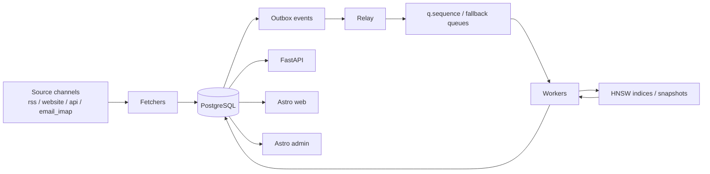
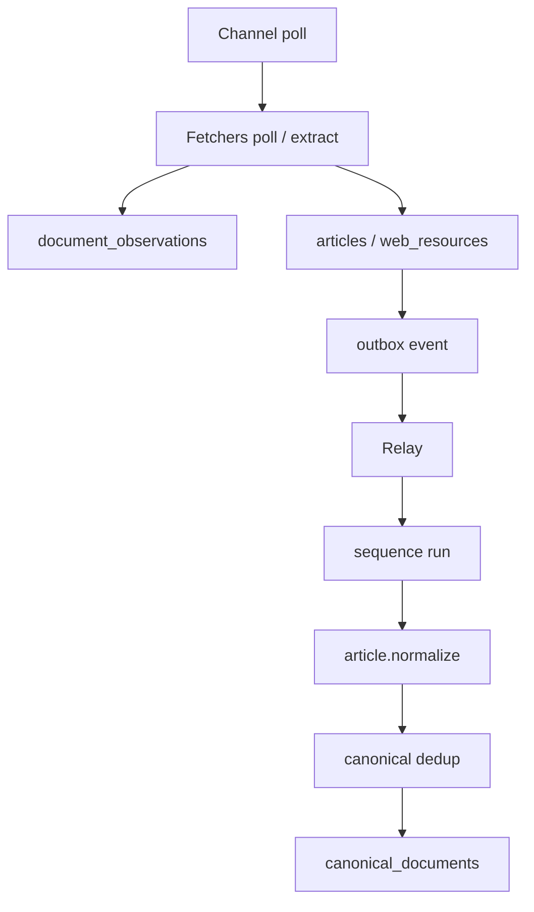
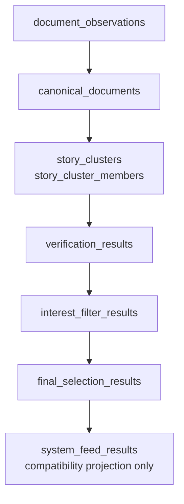
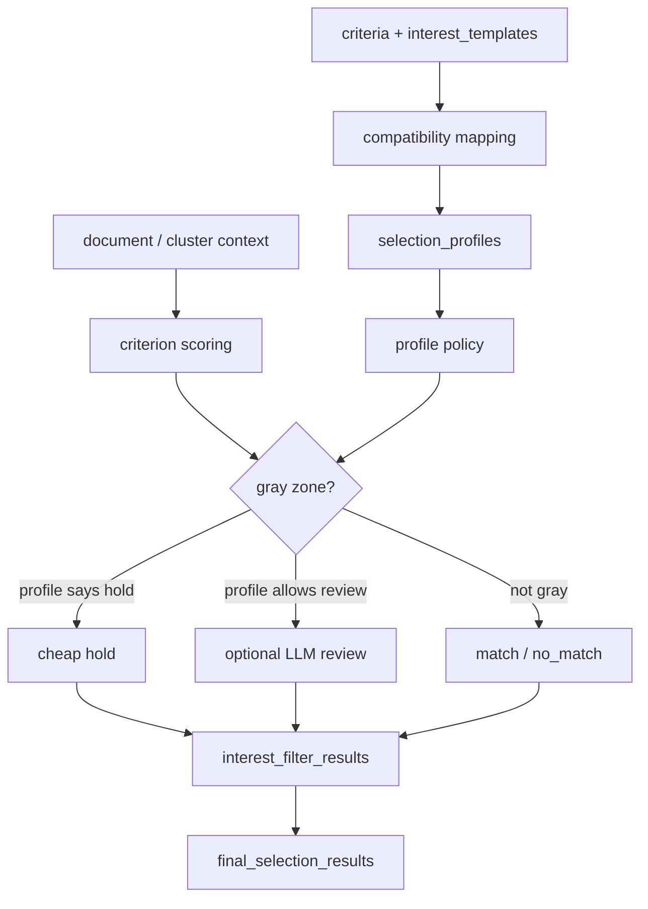
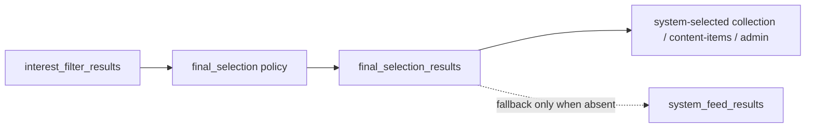
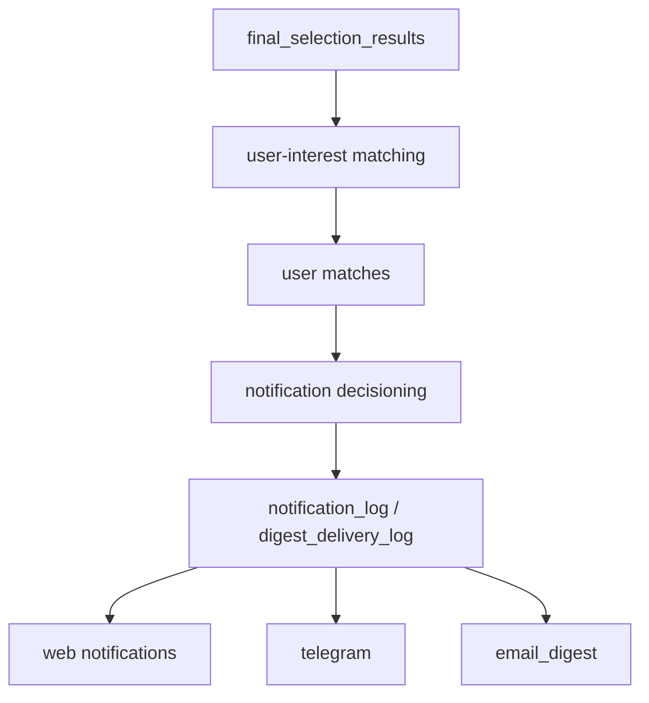
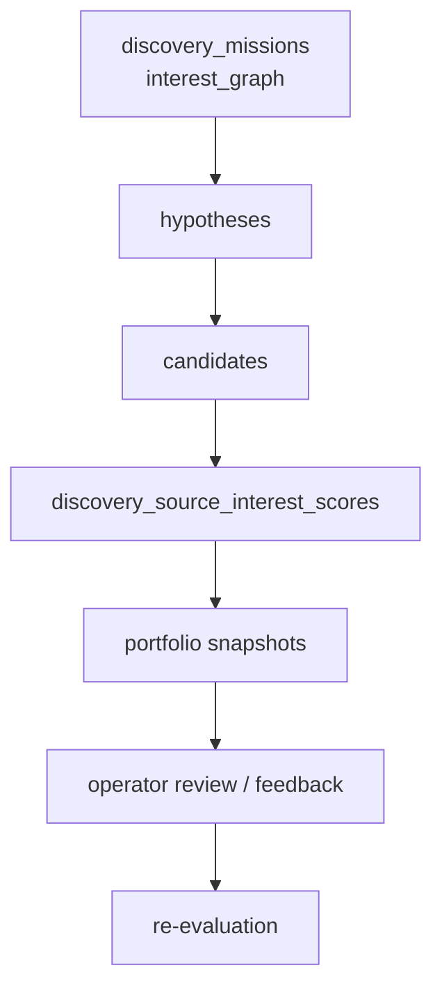
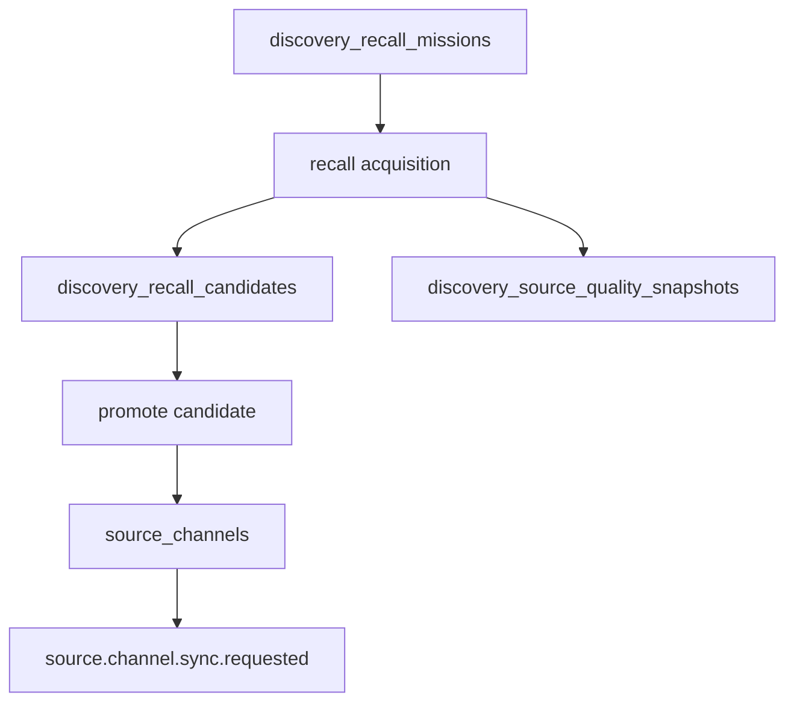
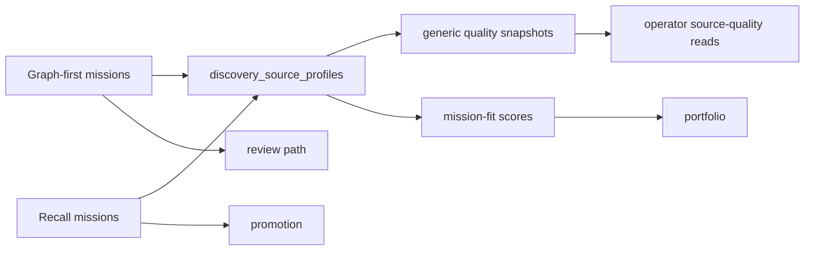

# Architecture Overview

Этот документ дает быстрый current-state walkthrough системы после shipped zero-shot cutover, universal selection-profile migration и shipped dual-path discovery.

Он не заменяет:

- [`docs/blueprint.md`](/Users/user/Documents/workspace/my/NewsPortal/docs/blueprint.md)
- [`docs/contracts/zero-shot-interest-filtering.md`](/Users/user/Documents/workspace/my/NewsPortal/docs/contracts/zero-shot-interest-filtering.md)
- [`docs/contracts/universal-selection-profiles.md`](/Users/user/Documents/workspace/my/NewsPortal/docs/contracts/universal-selection-profiles.md)
- [`docs/contracts/discovery-agent.md`](/Users/user/Documents/workspace/my/NewsPortal/docs/contracts/discovery-agent.md)
- [`docs/contracts/independent-recall-discovery.md`](/Users/user/Documents/workspace/my/NewsPortal/docs/contracts/independent-recall-discovery.md)

Его задача другая: быстро показать, как все реально работает вместе.

## 1. Главная идея

Система больше не является просто “новостным RSS-парсером” или “набором template matchers”.

Сейчас она состоит из 4 больших контуров:

1. ingest и normalization;
2. zero-shot selection и personalization;
3. operator/read-model и maintenance replay;
4. discovery как dual-path acquisition layer.

## 2. Верхнеуровневая карта



Ключевой принцип:

- PostgreSQL остается source of truth;
- очереди и индексы являются derived/runtime слоями;
- UI и API читают уже материализованную truth, а не владеют pipeline.

## 3. Ingest и канонизация

### 3.1 Поток ingest



Что важно:

- RSS/Atom distinction живет внутри `rss` boundary через adapter layer;
- website-ingestion идет через `web_resources`, а не через скрытую RSS-конверсию;
- editorial-compatible website rows могут project-иться в `articles`, но `web_resources` не теряют свою собственную truth.

## 4. Zero-shot selection pipeline

### 4.1 Материализованный pipeline



Слои значат следующее:

- `document_observations`
  Сырым фактом является наблюдение документа/статьи.
- `canonical_documents`
  Канонизированный документ после dedup ownership.
- `story_clusters`
  Story/event grouping поверх canonical layer.
- `verification_results`
  Проверка силы/согласованности сигнала.
- `interest_filter_results`
  Технический и семантический zero-shot filtering.
- `final_selection_results`
  Основная final-selection truth.
- `system_feed_results`
  Только bounded compatibility projection.

### 4.2 Семантика selection после universal-profile migration



Главный смысл:

- доменная логика больше не должна быть скрыта только в engine;
- `selection_profiles` делают profile/policy truth явной;
- `hold` является нормальным cheap outcome;
- LLM не является обязательным hot path.

### 4.3 Final-selection truth



Read-path truth сейчас такая:

- сначала читается `final_selection_results`;
- `system_feed_results` используется только как compatibility fallback;
- operator surfaces дополнительно получают нормализованные `selection_*` поля, diagnostics и guidance.

## 5. Personalization и нотификации



Здесь важны 2 правила:

- personalization больше не должна тихо обходить final-selection truth;
- `email_digest` остается digest-only каналом, а immediate delivery truth живет отдельно.

## 6. Operator и maintenance слой

### 6.1 Read-model surfaces

```mermaid
flowchart LR
  PG[(PostgreSQL)] --> API[FastAPI maintenance/read APIs]
  API --> A1[/maintenance/articles]
  API --> A2[/content-items]
  API --> A3[/maintenance/web-resources]
  API --> A4[/maintenance/reindex-jobs]
  API --> A5[/system-interests]
  A1 --> ADM[Astro admin]
  A2 --> WEB[Astro web]
  A3 --> ADM
  A4 --> ADM
  A5 --> ADM
```

Operator truth теперь включает:

- `selectionMode`;
- `selectionSummary`;
- `selectionReason`;
- `selectionDiagnostics`;
- `selectionGuidance`;
- replay provenance через `selectionProfileSnapshot`.

### 6.2 Historical replay / backfill

```mermaid
flowchart TD
  RJ[reindex job] --> SNAP[freeze target snapshot]
  SNAP --> ENR[optional enrichment replay]
  ENR --> REFILT[rebuild filter rows]
  REFILT --> FSR[rebuild final_selection_results]
  FSR --> COMPAT[bounded compatibility projection sync]
  COMPAT --> RES[result_json + selectionProfileSnapshot]
  RES --> MR[/maintenance/reindex-jobs]
```

Что важно:

- replay теперь несет не только счетчики, но и profile provenance;
- historical repair не должен рассылать retro notifications;
- compatibility closeout является наблюдаемым, а не скрытым.

## 7. Discovery как dual-path control plane

Сейчас discovery больше не graph-first-only в операционном смысле.

Есть 2 связанных, но разных пути.

### 7.1 Graph-first adaptive discovery



Это путь для:

- mission planning;
- hypothesis-driven source search;
- mission-fit ranking;
- feedback loop.

### 7.2 Independent recall discovery



Это путь для:

- neutral recall backlog;
- generic source quality;
- bounded recall-first acquisition;
- promotion в `source_channels` без обязательного `interest_graph`.

### 7.3 Как они связаны



Главная мысль:

- `discovery_source_profiles` являются shared source identity layer;
- `discovery_source_interest_scores` выражают mission-fit;
- `discovery_source_quality_snapshots` выражают generic source quality;
- discovery теперь dual-path, но не хаотичный.

## 8. Что сейчас является primary truth

Если смотреть сверху вниз:

- channel/source truth:
  - `source_channels`
- raw observation truth:
  - `document_observations`
- canonical/story/verification truth:
  - `canonical_documents`
  - `story_clusters`
  - `verification_results`
- semantic/final selection truth:
  - `interest_filter_results`
  - `final_selection_results`
- compatibility-only truth:
  - `system_feed_results`
- profile semantics truth:
  - `selection_profiles`
- graph-first discovery planning truth:
  - `discovery_missions.interest_graph`
- neutral recall/discovery quality truth:
  - `discovery_source_quality_snapshots`
  - `discovery_recall_missions`
  - `discovery_recall_candidates`

## 9. Что важно не перепутать

- `articles` не являются единственной product truth после universal content и observation layering.
- `system_feed_results` больше не являются primary owner final selection.
- `selection_profiles` не заменяют весь scoring engine мгновенно, но уже являются явной semantics/config truth.
- discovery не является больше только mission/hypothesis review path.
- recall quality и downstream selected-content yield не должны смешиваться.

## 10. Куда смотреть дальше

Для деталей:

- полный blueprint:
  [`docs/blueprint.md`](/Users/user/Documents/workspace/my/NewsPortal/docs/blueprint.md)
- zero-shot pipeline contract:
  [`docs/contracts/zero-shot-interest-filtering.md`](/Users/user/Documents/workspace/my/NewsPortal/docs/contracts/zero-shot-interest-filtering.md)
- universal selection profiles:
  [`docs/contracts/universal-selection-profiles.md`](/Users/user/Documents/workspace/my/NewsPortal/docs/contracts/universal-selection-profiles.md)
- adaptive discovery:
  [`docs/contracts/discovery-agent.md`](/Users/user/Documents/workspace/my/NewsPortal/docs/contracts/discovery-agent.md)
- independent recall discovery:
  [`docs/contracts/independent-recall-discovery.md`](/Users/user/Documents/workspace/my/NewsPortal/docs/contracts/independent-recall-discovery.md)
