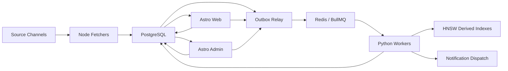

# Master Blueprint: zero-shot система фильтрации, персонализации и нотификаций новостей

## Runtime-core summary

Этот документ остается главным human-readable source of truth для NewsPortal. Разделы ниже содержат полный master blueprint; текущий summary нужен как быстрый reload для runtime core и должен читаться вместе с детальными разделами ниже, а не вместо них.

### Назначение системы

NewsPortal строится как zero-shot система фильтрации, персонализации, event clustering и нотификаций новостей для одного B2C white-label-ready продукта на рынках USA и Евросоюза.

### Product meaning

Система должна принимать поток новостей из нескольких типов источников, нормализовать и дедуплицировать контент, находить совпадения по system criteria и user interests без retrain, объяснимо доставлять важные события пользователю и сохранять управляемую эксплуатационную стоимость.

### Technical model

- polyglot monorepo с Astro apps, Node fetch/relay services и Python NLP/indexing services;
- PostgreSQL как единственный source of truth;
- Redis + BullMQ только как transport layer;
- HNSW indices, snapshots, model cache и прочие derived artifacts пересобираемы;
- shared contracts, SDK, UI и config вынесены в `packages/*`.

### Operating model

Основной путь данных выглядит так:

`source channel -> Node fetcher -> PostgreSQL -> outbox_events -> relay -> BullMQ -> Python workers -> PostgreSQL/HNSW derived state -> Astro web/admin, API и notification dispatch`

Главный write principle: пользовательский и сервисный command path сначала фиксирует бизнес-изменение в PostgreSQL, затем публикует outbox event; тяжелая обработка выполняется асинхронно worker-ами, а UI читает результат из PostgreSQL.

### Capability model

Долговременная capability-модель системы разбита на пять линий развития:

- platform foundation;
- ingest foundation;
- NLP foundation;
- matching and notification;
- explainability and operations.

Эти линии могут реализовываться по stages, но их архитектурный смысл должен оставаться стабильным.

### Core invariants

- PostgreSQL является единственным source of truth для критичных бизнес-данных.
- Redis и BullMQ используются только как transport, coordination и retry layer.
- Система остается zero-shot only: без online learning, retrain по кликам и training pipeline.
- Тяжелая NLP/matching logic не уходит в frontend runtimes и не становится sync internal REST path.
- Derived state обязан быть rebuildable из PostgreSQL.

### Boundary map

- UI/BFF и пользовательские команды отделены от тяжелой асинхронной обработки.
- PostgreSQL truth отделен от derived state в HNSW, snapshots, cache и queue state.
- Node fetch/relay responsibilities отделены от Python NLP/indexer responsibilities.
- Public/read API и explain surfaces отделены от внутреннего pipeline orchestration.

### Structural rules

- `apps/*` содержат только Astro product surfaces.
- `services/fetchers` и `services/relay` несут Node/TypeScript ingest and routing responsibilities.
- `services/api`, `services/workers`, `services/ml`, `services/indexer` несут Python read, processing, ML и rebuild responsibilities.
- `packages/*` хранят shared contracts, SDK, UI primitives и config.
- `database/*` хранит DDL, migrations и seeds; `infra/docker/*` задает официальный Compose baseline.
- Queue payload design остается тонким и ID-based.

### Forbidden shortcuts

- Нельзя вводить SQLite как основную БД.
- Нельзя использовать `pgvector` как primary ANN baseline.
- Нельзя превращать внутренний REST между Astro/Node и Python в основной heavy-processing transport.
- Нельзя класть большие article payload в очереди.
- Нельзя переносить тяжелую NLP/matching logic в frontend runtime.
- Нельзя допускать неконтролируемые admin operations без аудита.

### Risk zones

- Queue consistency и outbox/inbox semantics: риск потери событий, дублирующей обработки и рассинхронизации статусов; минимум proof — relay/migration/worker smoke на реальном пути PostgreSQL -> BullMQ -> consumer.
- Derived indices и compiled state: риск drift между PostgreSQL и HNSW-derived слоями; минимум proof — targeted rebuild/check commands и smoke pipeline вокруг embeddings, clustering или compile flow.
- Auth/session bridge и notification delivery: риск сломанного пользовательского command/read path между Astro, API и dispatch layer; минимум proof — targeted endpoint и compose-level validation для затронутой поверхности.
- Gray-zone LLM review и suppression: риск ложных решений и непрозрачной логики в чувствительной зоне; минимум proof — targeted worker smoke плюс честная фиксация residual gaps.

Остальная часть документа ниже остается детальным, долговременным архитектурным reference без радикального переписывания под runtime-core summary.

## 1. Назначение документа

Этот документ является сводным master blueprint для проектирования и реализации системы zero-shot фильтрации новостей, event clustering, персонализации и нотификаций.

Цель документа:

- зафиксировать итоговые архитектурные решения;
- снять противоречия между версиями;
- описать полный целевой baseline системы;
- дать основу, по которой можно проектировать БД, сервисы, очереди, API, UI и deployment;
- явно отделить принятые решения от открытых вопросов.

Этот документ должен считаться главным reference-документом для дальнейшего проектирования.

---

## 2. Итоговые архитектурные решения

Ниже зафиксированы решения, которые считаются финальными для текущей версии blueprint.

| Тема | Встречавшиеся варианты | Финальное решение |
| --- | --- | --- |
| Основная БД | SQLite, PostgreSQL | PostgreSQL как единственный source of truth |
| Full-text search | SQLite FTS5, Postgres FTS | PostgreSQL Full-Text Search |
| ANN слой | hnswlib, местами `pgvector` | `hnswlib` как основной derived ANN слой; `pgvector` не обязателен |
| Frontend | Next.js, Astro | Astro для `web` и `admin` |
| Fetching слой | Python fetchers, Node fetchers | Node/TypeScript fetchers |
| NLP и matching | смешанный слой, Python | Python runtime |
| Межсервисный transport | внутренний REST, очередь | Redis + BullMQ / BullMQ Python |
| Консистентность | прямой enqueue, разные варианты | PostgreSQL + outbox relay + inbox/idempotency |
| Репозиторий | разрозненные сервисы, монорепо | Polyglot monorepo |
| Deployment baseline | systemd only, Compose addendum | Docker Compose как основной single-host baseline с подготовкой к будущему разделению по нескольким машинам |
| Product mode | single product, multi-product, white-label | Single-tenant B2C white-label-ready архитектура для одного продукта с полным white-label scope |
| Sources baseline | разные варианты | RSS, websites, IMAP-polled email feeds, external APIs; YouTube закладывается как first-class future provider; browser-heavy fetchers не обязательны в MVP |
| Language and market coverage | частичная мультиязычность | Английский, украинский и языки рынков ЕС; приоритетные рынки USA и Евросоюз |
| Auth | локальный auth, Firebase | Firebase Auth подтвержден как baseline auth layer; в MVP пользовательский вход анонимный, admin использует неанонимную Firebase identity + локальную роль |
| UI system | custom UI, native browser controls, mixed | `packages/ui` строится на `shadcn/ui`; в `web` и `admin` запрещены raw browser-default controls на продуктовых экранах |
| Theme model | light/dark only, white-label only | Три режима темы: `light`, `dark`, `system(native)`; white-label branding накладывается поверх общих design tokens |
| Content model | text-only news, media later | Контент-модель media-capable с первого этапа: текст, изображения, видео, embed metadata; пригодна для будущих video-first источников |
| Moderation and engagement | passive read-only admin | Admin может блокировать/разблокировать новости, видеть per-article like/dislike counters и KPI dashboard |
| Notification channels | разные варианты | Web push и Telegram для алертов, email для еженедельных digest-писем |
| Gray zone policy | manual review, no LLM, optional LLM | Автоматический асинхронный LLM-review для gray zone с admin-configurable prompt через внешний LLM API |
| External integration | internal only, none | Публичное API обязательно и покрывает клиентские сценарии |
| Feedback | none, analytics later | Feedback `helpful / not_helpful` хранится с первого этапа для будущей дополнительной персонализации |

---

## 3. Что строим

Система строится с нуля и должна:

- работать как white-label-ready платформа для одного B2C продукта без multi-tenancy;
- принимать поток статей из множества источников и каналов;
- нормализовать и дедуплицировать статьи;
- определять `exact duplicate`, `near duplicate`, `same event`, `same topic`;
- делать zero-shot matching статьи к системным критериям;
- делать zero-shot matching статьи к интересам пользователей;
- позволять пользователю менять интересы без retrain и без обучения модели;
- поддерживать media-rich новости с изображениями, видео и embed-метаданными без переделки доменной модели;
- отправлять нотификации по новым событиям и major updates;
- иметь пользовательский интерфейс и административный интерфейс;
- иметь минимальный moderation baseline: block/unblock новости, аудит действий и метрики по реакциям;
- быть рассчитанной на single-host deployment;
- быть дешевой в эксплуатации;
- быть CPU-friendly;
- использовать open-source NLP stack там, где это возможно;
- быть пригодной для поэтапного вывода в production.

На старте система ориентирована на:

- B2C аудиторию;
- один продукт;
- single-tenant deployment model;
- рынки USA и Евросоюза;
- английский язык, украинский язык и языки целевых рынков ЕС.

Система проектируется под средний масштаб:

- до 100k статей в сутки как комфортный baseline;
- 100k-300k пользователей как целевой диапазон первой production-итерации;
- 2-5 активных interest blocks на пользователя как нормальный режим.

---

## 4. Границы системы

### 4.1. Что входит в систему

- white-label branding/config слой для одного продукта;
- registry источников и каналов;
- fetchers и ingest orchestration;
- хранение статей и их признаков;
- zero-shot matching и event clustering;
- compiled criteria и compiled user interests;
- notification decisioning;
- suppression и anti-spam;
- хранение пользовательского feedback по алертам;
- user web app;
- admin app;
- public API для внешних клиентов;
- explainability screens;
- media metadata и media rendering contract для новостей;
- article reactions `like / dislike`;
- admin dashboard KPI и lightweight moderation;
- reindex и rebuild tooling;
- single-host deployment baseline.

### 4.2. Что не входит в baseline

- обучение на кликах;
- user embeddings, обученные по поведению;
- recommendation engine на основе collaborative filtering;
- multi-tenant isolation model;
- Kubernetes;
- service mesh;
- распределенный multi-region deployment;
- выделенная vector DB как обязательный компонент;
- LLM в основном ingest path;
- browser-heavy anti-bot fetching как обязательная часть MVP;
- богатый ручной moderation workflow сверх простого `block/unblock` новости как обязательная часть MVP.

---

## 5. Жесткие ограничения и принципы

### 5.1. Zero-shot only

Система не использует:

- обучение моделей на поведении;
- дообучение на пользовательских кликах;
- online learning;
- train pipeline;
- retrain при каждом изменении интересов.

Разрешено:

- embeddings;
- правила;
- полнотекстовый поиск;
- дедупликация;
- ANN поиск;
- фиксированные формулы скоринга;
- ручные пороги;
- explainable heuristics.

### 5.2. PostgreSQL как источник истины

Все критичные бизнес-данные фиксируются в PostgreSQL.

Вне PostgreSQL допускаются только производные данные:

- HNSW индексы;
- snapshot-файлы индексов;
- локальные модели и ONNX artifacts;
- временные batch-артефакты;
- очереди;
- cache;
- runtime leases и ephemeral state.

### 5.3. Нет внутреннего REST между Node и Python как основного протокола

Node/Astro и Python не должны синхронно дергать друг друга по REST на каждую тяжелую операцию.

Причины:

- выше связность;
- хуже backpressure;
- хуже retries;
- сложнее batching;
- сложнее контролировать write path;
- тяжелые CPU-задачи начинают блокировать пользовательский слой.

### 5.4. Redis и BullMQ только как transport

Redis не является источником истины.

Он используется для:

- транспортного слоя очередей;
- delayed jobs;
- retries;
- queue state;
- lightweight coordination;
- rate limiting;
- optional locks.

### 5.5. Минимизация цены

Нужно минимизировать:

- число вызовов embedding модели;
- число сравнений документ -> все пользователи;
- число больших payload в очередях;
- количество сервисов;
- объем derived state;
- количество тяжелых сетевых hops.

### 5.6. Derived state всегда пересобираем

Если HNSW, кеши или очереди сломались, бизнес-данные не должны теряться.

Система должна штатно поддерживать:

- rebuild индексов;
- backfill embeddings;
- recompile interests;
- recompile criteria;
- replay outbox;
- re-drive failed jobs.

### 5.7. LLM только в контролируемой серой зоне

LLM допускается только как асинхронный слой для gray zone и не должен заменять основной zero-shot path.

Разрешенный режим:

- авто-review только для кейсов, попавших в серую зону;
- отдельная очередь и отдельный decision log;
- prompt и policy настраиваются из admin UI;
- prompt version должен храниться вместе с решением;
- вызов идет только во внешний LLM API provider;
- LLM решение не должно блокировать ingest и основной write path.

LLM не должен быть обязательным шагом для каждой статьи.

### 5.8. Single-tenant white-label baseline

Система проектируется как single-tenant B2C продукт, но должна сохранять простой white-label слой:

- branding config;
- theme tokens;
- product copy/config;
- notification branding;
- public API branding/versioning;
- отдельные наборы источников;
- prompt templates;
- notification rules;
- digest templates.

Полная multi-tenant модель в baseline не требуется.

### 5.9. Feedback и article reactions хранятся, но не участвуют в baseline scoring

С первого этапа нужно сохранять:

- пользовательский feedback по алертам;
- пользовательские реакции на новости `like / dislike`.

В baseline эти сигналы:

- не используются для обучения модели;
- не встраиваются в текущий zero-shot score;
- не меняют dedup, clustering и matching-решения напрямую;
- хранятся для будущей дополнительной персонализации, аналитики, quality review и rule tuning.

### 5.10. UI policy: только `shadcn/ui`-based product components

Для `web` и `admin` фиксируется следующий baseline:

- все кнопки, поля ввода, select, checkbox, switch, dialog, drawer, table, tabs, toast, dropdown и прочие product UI controls приходят из `packages/ui`, собранного поверх `shadcn/ui`;
- нативные HTML элементы допустимы только как внутренности этих компонентов или как чисто семантическая разметка контента;
- на продуктовых экранах не должно быть browser-default styling у контролов;
- стилизация должна идти через общие design tokens и CSS variables, а не ad-hoc inline styling на уровне приложений.

### 5.11. Theme model: `light`, `dark`, `system(native)`

Тема должна работать одинаково в `web` и `admin`.

Базовые правила:

- пользовательский выбор хранится как `light | dark | system`;
- `system` означает следование системной теме устройства/браузера;
- brand tokens и white-label overrides должны быть совместимы со всеми тремя режимами;
- темы не должны расходиться по составу компонентов, меняются только tokens, semantic colors, elevation и media treatment.

---

## 6. Нефункциональные требования

Система должна быть:

- explainable;
- идемпотентной;
- восстановимой после сбоя;
- single-host friendly;
- наблюдаемой;
- пригодной для постепенного масштабирования;
- дешевой в сопровождении;
- безопасной с точки зрения ролей, секретов и административных операций.

Ключевые эксплуатационные свойства:

- новая статья должна проходить pipeline асинхронно;
- UI не должен ждать завершения NLP-операций;
- queue payload не должен тащить большие тексты;
- любой шаг должен быть retry-safe;
- изменение user interest не должно требовать retrain;
- сбой derived state не должен портить source data;
- у системы нет жесткого SLA на мгновенную доставку alert в MVP;
- архитектура должна позволять позже разнести runtime по нескольким машинам без полной переделки доменной модели.

---

## 7. Логическая архитектура

Система состоит из следующих слоев:

1. Frontend layer
2. Command and orchestration layer
3. Core storage layer
4. Fetching layer
5. NLP and matching layer
6. Notification layer
7. Rebuild and maintenance layer
8. Observability and operations layer

### 7.1. Поток данных



### 7.2. Главный архитектурный принцип

Пользовательский слой пишет команду в PostgreSQL, а не вызывает тяжелую логику напрямую.

Правильная модель:

- browser -> Astro;
- Astro -> PostgreSQL transaction;
- transaction -> outbox event;
- relay -> BullMQ job;
- worker -> heavy processing;
- worker -> PostgreSQL result;
- UI читает результат из PostgreSQL.

---

## 8. Технологический стек

### 8.1. Frontend

- Astro
- TypeScript
- React islands для интерактивных зон; route-level React islands допустимы для form-heavy и dashboard-heavy экранов
- Tailwind CSS
- `shadcn/ui` как единый baseline для product components через shared `packages/ui`
- shared UI package
- generated TypeScript SDK для API/контрактов

### 8.1.1. UI и design-system baseline

- `packages/ui` является единственным источником UI primitives для `web` и `admin`;
- `packages/ui` собирается из `shadcn/ui`-компонентов и их project-specific wrappers;
- дизайн должен быть editorial + dashboard oriented: премиальный, плотный, современный, но без визуального шума;
- все формы, фильтры, таблицы, карточки, drawers, media blocks и dashboard widgets должны использовать единый токенизированный стиль;
- news cards и detail screens должны штатно поддерживать text-only, image-first и video-first presentation;
- переходы, skeleton states и empty states должны быть частью дизайн-системы, а не локальными исключениями.

### 8.1.2. Theming и branding

- три поддерживаемых режима: `light`, `dark`, `system(native)`;
- базовые токены: `background`, `foreground`, `muted`, `accent`, `border`, `ring`, `card`, `popover`, `destructive`, `success`, `warning`;
- white-label слой может переопределять brand palette, typography accents, radius и imagery style, не ломая accessibility и layout density;
- theme resolution должна быть одинаковой для SSR и hydrated islands, чтобы не было flash of wrong theme.

### 8.2. Auth

Рекомендуемый baseline:

- Firebase Authentication для browser auth;
- Firebase Anonymous Auth как основной user entry point в MVP;
- Firebase Web SDK на клиенте;
- Firebase Admin SDK в Node/Astro runtime для проверки ID token и session cookie;
- PostgreSQL для локального профиля, ролей, настроек и business data.

Важное ограничение:

- Firebase Auth считается подтвержденным baseline;
- anonymous users поддерживаются только для конечных пользователей, не для admin routes;
- доменные сущности не должны зависеть от Firebase-специфичных таблиц сильнее, чем через `auth_subject`;
- при необходимости auth provider можно будет заменить через adapter слой без ломки бизнес-сущностей.

### 8.3. Node runtime

- Node.js LTS
- BullMQ
- Prisma только как удобный typed client для части CRUD в Node-слое, но не как владелец схемы
- raw SQL там, где нужны advanced Postgres features
- Playwright
- Crawlee

### 8.4. Python runtime

- Python 3.11+
- FastAPI для thin read/debug API
- SQLAlchemy 2.x
- Alembic
- Pydantic
- sentence-transformers
- ONNX/OpenVINO backend
- fastText lid.176
- datasketch
- simhash
- hnswlib

### 8.5. Storage

- PostgreSQL 16+
- PostgreSQL Full-Text Search
- `hnswlib` как derived ANN слой
- файловые snapshots индексов

### 8.6. Ops

- Docker Compose
- Nginx
- structured JSON logs
- health endpoints
- optional Prometheus/Grafana на следующем этапе

### 8.7. Что не требуется в baseline

- pgvector как обязательный компонент;
- отдельная vector DB;
- Kafka;
- Kubernetes;
- distributed tracing stack как hard requirement.

`pgvector` можно добавить позже для диагностики, small-scale similarity experiments или миграционного слоя, но не как основной ANN baseline.

---

## 9. Монорепозиторий

### 9.1. Почему нужен монорепозиторий

Монорепо нужно, чтобы в одном месте держать:

- `web`;
- `admin`;
- Node fetchers;
- relay;
- Python workers;
- Python ML library;
- shared contracts;
- shared UI;
- миграции;
- Docker/infra;
- документацию;
- scripts и reindex tooling.

Это дает:

- единый CI/CD;
- единый source of truth по контрактам;
- согласованную структуру типов;
- проще локальный запуск;
- проще релизы.

### 9.2. Целевая структура

```text
/news-platform/
  apps/
    web/
    admin/
  services/
    fetchers/
    relay/
    api/
    workers/
    ml/
    indexer/
  packages/
    ui/
    contracts/
    sdk/
    config/
  database/
    migrations/
    ddl/
    seeds/
  infra/
    docker/
    nginx/
    systemd/
    scripts/
  data/
    models/
    indices/
    snapshots/
    logs/
  docs/
  package.json
  pnpm-workspace.yaml
  turbo.json
  README.md
```

### 9.3. Ответственность каталогов

#### `apps/web`

- анонимный вход в MVP и последующий account linking как future capability;
- управление interest blocks;
- просмотр matched news;
- просмотр media-rich news cards/detail;
- реакции `like / dislike` на новости;
- история нотификаций;
- переключение темы `light / dark / system`;
- пользовательские настройки;
- job status/read models.

#### `apps/admin`

- channels и providers;
- dashboard KPI;
- health pages;
- queue status;
- ingest errors;
- block/unblock новостей;
- просмотр like/dislike counters по каждой новости;
- explain screens;
- clusters;
- suppression logs;
- reindex/replay actions.

#### `services/fetchers`

- RSS fetchers;
- HTTP/HTML fetchers;
- browser fetchers;
- Crawlee pipelines;
- anti-bot browser flows;
- запись raw article;
- запись outbox events.

#### `services/relay`

- чтение `outbox_events`;
- публикация job в BullMQ;
- обновление статуса доставки;
- re-drive failed publishing.

#### `services/api`

- health endpoints;
- debug endpoints;
- explain read endpoints;
- internal read helpers.

Python API не должен становиться главным sync API между UI и NLP.

#### `services/workers`

- normalize;
- dedup;
- embed;
- cluster;
- criteria matching;
- interest matching;
- notify;
- reindex orchestration.

#### `services/ml`

- preprocessing;
- feature extraction;
- embedding inference;
- criterion compiler;
- interest compiler;
- similarity functions;
- scoring formulas.

#### `services/indexer`

- rebuild HNSW;
- backfill embeddings;
- recompile compiled state;
- archive cleanup;
- retention tasks.

#### `packages/contracts`

- DTO;
- queue payload schemas;
- event schemas;
- OpenAPI fragments;
- JSON schemas.

#### `packages/sdk`

- generated TS SDK для `web` и `admin`.

#### `packages/ui`

- `shadcn/ui`-based shared components;
- form primitives и composable field wrappers;
- table primitives;
- charts/status widgets;
- media cards и player shells;
- theme provider и theme switcher primitives;
- explain UI blocks.

#### `packages/config`

- brand config;
- theme tokens;
- theme mode defaults;
- prompt template config;
- notification channel config;
- public API config.
- source bundle config;
- digest template config;

---

## 10. Runtime-компоненты и их ответственность

Минимальный production baseline:

- `web`
- `admin`
- `fetchers`
- `relay`
- `api`
- `workers`
- `dispatch`
- `postgres`
- `redis`
- `nginx`

Опциональные сервисы:

- `indexer`
- `llm-review` как отдельный worker profile при необходимости
- `pgadmin` только в dev
- `redis-commander` только в dev

### 10.1. `web`

Astro user app.

Отвечает за:

- пользовательские страницы;
- browser auth integration;
- anonymous Firebase session bootstrap в MVP;
- interests;
- matched news;
- media-capable article feed и detail screens;
- article reactions `like / dislike`;
- notifications;
- theme preference management;
- server actions;
- чтение read models;
- запись команд.

### 10.2. `admin`

Astro admin app.

Отвечает за:

- каналы;
- dashboard summary;
- источники;
- status pages;
- queue visibility;
- explain pages;
- article moderation `block / unblock`;
- per-article reaction counters;
- cluster review;
- reindex actions;
- LLM prompt template management;
- interest template management.

### 10.3. `fetchers`

Node/TypeScript runtime.

Отвечает за:

- polling источников;
- browser automation;
- extraction raw article payload;
- запись статьи в PostgreSQL;
- создание outbox event `article.ingest.requested`.

### 10.4. `relay`

Outbox relay.

Отвечает за:

- чтение `outbox_events`;
- публикацию задач в BullMQ;
- повторную отправку при ошибках;
- маркировку `published_at`, `attempt_count`, `status`.

### 10.5. `api`

Тонкий Python read/debug layer.

Отвечает за:

- health;
- debug;
- internal explain;
- internal read endpoints.

### 10.6. `workers`

Python worker runtime.

Отвечает за:

- normalization;
- language detection;
- feature extraction;
- dedup;
- embeddings;
- cluster assignment;
- criteria matching;
- interest fanout;
- notification decisioning.

### 10.7. `indexer`

Maintenance runtime.

Отвечает за:

- HNSW rebuild;
- vector registry repair;
- backfill embeddings;
- recompile interests;
- archive/repartition tasks.

### 10.8. `dispatch`

Notification delivery adapter.

Отвечает за:

- web push delivery;
- Telegram delivery;
- weekly email digest generation и отправку;
- retry и delivery logs.

---

## 11. Модель данных

### 11.1. Основные доменные сущности

- User
- UserProfile
- Role
- UserInterest
- InterestTemplate
- Criterion
- SourceProvider
- SourceChannel
- FetchCursor
- Article
- ArticleMediaAsset
- ArticleFeatures
- ArticleExternalRef
- UserArticleReaction
- ArticleModerationAction
- ArticleFamily
- EventCluster
- EventClusterMember
- NotificationLog
- CriterionMatchResult
- InterestMatchResult
- UserNotificationChannel
- NotificationFeedback
- NotificationSuppression
- LlmPromptTemplate
- LlmReviewLog
- OutboxEvent
- InboxProcessedEvent
- ReindexJob
- AuditLog
- VectorRegistry tables

### 11.2. User

Минимальная доменная модель:

```json
{
  "user_id": "uuid",
  "auth_subject": "string",
  "auth_provider": "firebase_anonymous|firebase_google|firebase_email_link|firebase_other",
  "email": "string|null",
  "is_anonymous": true,
  "status": "active",
  "created_at": "datetime",
  "updated_at": "datetime"
}
```

`auth_subject` должен хранить внешний идентификатор пользователя из auth provider.

В MVP пользователь по умолчанию создается через Firebase Anonymous Auth при первом входе.
Admin-пользователи должны использовать неанонимный Firebase sign-in и получать локальную роль `admin`.
Для internal/dev bootstrap допускается env-driven allowlist (`ADMIN_ALLOWLIST_EMAILS`), которая может выдать локальную роль `admin` при первом успешном sign-in; для repeatable internal tests exact allowlisted email может использоваться и через `+alias` variant того же адреса. После bootstrap источником истины для authorization все равно остается PostgreSQL.

### 11.3. UserProfile

```json
{
  "user_id": "uuid",
  "display_name": "string|null",
  "timezone": "string|null",
  "locale": "string|null",
  "theme_preference": "light|dark|system",
  "notification_preferences": {
    "web_push": true,
    "telegram": true,
    "weekly_email_digest": true
  }
}
```

### 11.4. UserInterest

```json
{
  "interest_id": "uuid",
  "user_id": "uuid",
  "description": "string",
  "positive_texts": ["string"],
  "negative_texts": ["string"],
  "must_have_terms": ["string"],
  "must_not_have_terms": ["string"],
  "places": ["string"],
  "languages_allowed": ["string"],
  "time_window_hours": 168,
  "short_tokens_required": ["string"],
  "short_tokens_forbidden": ["string"],
  "notification_mode": "new_event_or_major_update",
  "priority": 1.0,
  "enabled": true,
  "compiled": true,
  "updated_at": "datetime"
}
```

### 11.5. Criterion

```json
{
  "criterion_id": "uuid",
  "description": "string",
  "positive_texts": ["string"],
  "negative_texts": ["string"],
  "must_have_terms": ["string"],
  "must_not_have_terms": ["string"],
  "places": ["string"],
  "languages_allowed": ["string"],
  "time_window_hours": 168,
  "short_tokens_required": ["string"],
  "short_tokens_forbidden": ["string"],
  "priority": 1.0,
  "compiled": true
}
```

### 11.6. InterestTemplate

```json
{
  "template_id": "uuid",
  "name": "string",
  "description": "string",
  "positive_texts": ["string"],
  "negative_texts": ["string"],
  "is_active": true,
  "sort_order": 0
}
```

### 11.7. SourceProvider

Логический тип поставщика:

- RSS
- website
- API
- email IMAP feed
- YouTube connector как planned future provider
- Telegram connector как future provider
- custom parser

### 11.8. SourceChannel

```json
{
  "channel_id": "uuid",
  "provider_type": "rss|website|api|email_imap|youtube",
  "name": "string",
  "external_id": "string|null",
  "fetch_url": "string|null",
  "homepage_url": "string|null",
  "config_json": {},
  "country": "string|null",
  "language": "string|null",
  "is_active": true,
  "poll_interval_seconds": 300,
  "last_fetch_at": "datetime|null",
  "last_success_at": "datetime|null",
  "last_error_at": "datetime|null",
  "last_error_message": "string|null"
}
```

### 11.9. FetchCursor

```json
{
  "cursor_id": "uuid",
  "channel_id": "uuid",
  "cursor_type": "etag|timestamp|api_page_token|imap_uid|youtube_page_token|youtube_published_at",
  "cursor_value": "string|null",
  "cursor_json": {
    "mailbox": "string|null",
    "uid_validity": "string|null",
    "last_uid": "string|null",
    "page_token": "string|null"
  },
  "updated_at": "datetime"
}
```

### 11.10. Article

```json
{
  "doc_id": "uuid",
  "channel_id": "uuid",
  "source_article_id": "string|null",
  "url": "string",
  "content_format": "article|video_news|gallery|mixed",
  "published_at": "datetime",
  "ingested_at": "datetime",
  "title": "string",
  "lead": "string",
  "body": "string",
  "lang": "string",
  "lang_confidence": 0.0,
  "exact_hash": "string",
  "simhash64": "uint64",
  "family_id": "uuid|null",
  "event_cluster_id": "uuid|null",
  "primary_media_asset_id": "uuid|null",
  "has_media": false,
  "is_exact_duplicate": false,
  "is_near_duplicate": false,
  "visibility_state": "visible|blocked",
  "processing_state": "raw|normalized|embedded|clustered|matched|notified"
}
```

`articles.visibility_state = blocked` означает:

- статья остается в source-of-truth для explainability и аудита;
- статья исключается из пользовательских read models и active-news KPI;
- по ней нельзя отправлять новые пользовательские нотификации после блокировки.

### 11.10A. ArticleMediaAsset

```json
{
  "media_asset_id": "uuid",
  "doc_id": "uuid",
  "media_kind": "image|video|embed",
  "storage_kind": "external_url|youtube|object_storage",
  "url": "string",
  "thumbnail_url": "string|null",
  "embed_url": "string|null",
  "mime_type": "string|null",
  "width": 0,
  "height": 0,
  "duration_seconds": 0,
  "alt_text": "string|null",
  "sort_order": 0,
  "created_at": "datetime"
}
```

Эта таблица нужна, чтобы не переделывать доменную модель при добавлении фото, inline video и YouTube-based материалов.

### 11.11. ArticleFeatures

```json
{
  "doc_id": "uuid",
  "numbers": ["string"],
  "short_tokens": ["string"],
  "places": ["string"],
  "entities": ["string"],
  "search_vector_version": 1,
  "feature_version": 1
}
```

### 11.12. ArticleExternalRef

```json
{
  "external_ref_id": "uuid",
  "channel_id": "uuid",
  "external_article_id": "string",
  "doc_id": "uuid"
}
```

### 11.12A. UserArticleReaction

```json
{
  "reaction_id": "uuid",
  "doc_id": "uuid",
  "user_id": "uuid",
  "reaction_type": "like|dislike",
  "created_at": "datetime",
  "updated_at": "datetime"
}
```

На уровне БД должна быть гарантия не более одной активной реакции на пару `(user_id, doc_id)`.

### 11.12B. ArticleModerationAction

```json
{
  "moderation_action_id": "uuid",
  "doc_id": "uuid",
  "admin_user_id": "uuid",
  "action_type": "block|unblock",
  "reason": "string|null",
  "created_at": "datetime"
}
```

История moderation actions хранится отдельно от текущего `articles.visibility_state`, чтобы audit trail не зависел только от `audit_log`.

### 11.13. EventCluster

```json
{
  "cluster_id": "uuid",
  "created_at": "datetime",
  "updated_at": "datetime",
  "centroid_embedding_id": "string",
  "article_count": 0,
  "primary_title": "string",
  "top_entities": ["string"],
  "top_places": ["string"],
  "min_published_at": "datetime",
  "max_published_at": "datetime"
}
```

### 11.14. UserNotificationChannel

```json
{
  "channel_binding_id": "uuid",
  "user_id": "uuid",
  "channel_type": "web_push|telegram|email_digest",
  "is_enabled": true,
  "config_json": {},
  "verified_at": "datetime|null"
}
```

### 11.15. NotificationFeedback

```json
{
  "feedback_id": "uuid",
  "user_id": "uuid",
  "notification_id": "uuid",
  "doc_id": "uuid",
  "interest_id": "uuid|null",
  "feedback_value": "helpful|not_helpful",
  "created_at": "datetime"
}
```

### 11.16. NotificationLog

```json
{
  "notification_id": "uuid",
  "user_id": "uuid",
  "interest_id": "uuid",
  "doc_id": "uuid",
  "event_cluster_id": "uuid|null",
  "status": "queued|sent|suppressed|failed",
  "created_at": "datetime",
  "sent_at": "datetime|null"
}
```

### 11.17. CriterionMatchResult

```json
{
  "criterion_match_id": "uuid",
  "doc_id": "uuid",
  "criterion_id": "uuid",
  "score_pos": 0.0,
  "score_neg": 0.0,
  "score_lex": 0.0,
  "score_meta": 0.0,
  "score_final": 0.0,
  "decision": "relevant|irrelevant|gray_zone",
  "explain_json": {},
  "created_at": "datetime"
}
```

### 11.18. InterestMatchResult

```json
{
  "interest_match_id": "uuid",
  "doc_id": "uuid",
  "user_id": "uuid",
  "interest_id": "uuid",
  "score_pos": 0.0,
  "score_neg": 0.0,
  "score_meta": 0.0,
  "score_novel": 0.0,
  "score_interest": 0.0,
  "score_user": 0.0,
  "decision": "notify|suppress|gray_zone|ignore",
  "explain_json": {},
  "created_at": "datetime"
}
```

### 11.19. LlmPromptTemplate

```json
{
  "prompt_template_id": "uuid",
  "name": "string",
  "scope": "criteria|interests|global",
  "language": "string|null",
  "template_text": "string",
  "is_active": true,
  "version": 1
}
```

### 11.20. LlmReviewLog

```json
{
  "review_id": "uuid",
  "doc_id": "uuid",
  "scope": "criterion|interest",
  "target_id": "uuid",
  "prompt_template_id": "uuid",
  "prompt_version": 1,
  "llm_model": "string",
  "decision": "approve|reject|uncertain",
  "score": 0.0,
  "response_json": {},
  "created_at": "datetime"
}
```

### 11.21. OutboxEvent

```json
{
  "event_id": "uuid",
  "event_type": "string",
  "aggregate_type": "string",
  "aggregate_id": "uuid",
  "payload_json": {},
  "status": "pending|published|failed",
  "created_at": "datetime",
  "published_at": "datetime|null",
  "attempt_count": 0
}
```

### 11.22. InboxProcessedEvent

```json
{
  "consumer_name": "string",
  "event_id": "uuid",
  "processed_at": "datetime"
}
```

### 11.23. Registry таблицы

Нужны таблицы:

- `embedding_registry`
- `interest_vector_registry`
- `event_vector_registry`
- `article_vector_registry`
- `hnsw_registry`

Они связывают:

- `entity_id`
- `vector_type`
- `hnsw_label`
- `is_active`
- `updated_at`
- `vector_version`

---

## 12. Схема хранения в PostgreSQL

### 12.1. Основные группы таблиц

#### Auth

- `users`
- `user_profiles`
- `roles`
- `user_roles`
- `sessions` если нужны отдельные app sessions поверх auth provider

#### Sources

- `source_channels`
- `fetch_cursors`
- `fetch_jobs`
- `fetch_job_attempts`
- `source_health`

#### Content

- `articles`
- `article_media_assets`
- `article_features`
- `article_external_refs`
- `article_moderation_actions`
- `article_families`
- `event_clusters`
- `event_cluster_members`

#### Engagement and moderation

- `user_article_reactions`
- `article_reaction_stats` как materialized view или read table при необходимости

#### Personalization

- `criteria`
- `criteria_compiled`
- `criteria_match_results`
- `user_interests`
- `interest_templates`
- `user_interests_compiled`
- `interest_match_results`
- `notification_feedback`
- `notification_log`
- `user_notification_channels`
- `notification_suppression`
- `llm_prompt_templates`
- `llm_review_log`

#### Messaging and consistency

- `app_settings`
- `outbox_events`
- `inbox_processed_events`
- `worker_leases`
- `reindex_jobs`
- `audit_log`

#### Vectors and derived registries

- `embedding_registry`
- `interest_vector_registry`
- `event_vector_registry`
- `article_vector_registry`
- `hnsw_registry`

### 12.2. Что хранится в PostgreSQL обязательно

- users и профили;
- channels и cursors;
- raw и normalized article data;
- media metadata и moderation state;
- extracted features;
- dedup state;
- clusters;
- article reactions и агрегаты по ним;
- compiled interests/criteria;
- notification history;
- suppression state;
- outbox/inbox;
- operational jobs;
- audit trail.

### 12.3. Что хранится вне PostgreSQL

- HNSW файлы;
- snapshot files;
- локальные embedding models;
- temporary batch outputs;
- runtime cache.

### 12.4. Postgres FTS

Для статьи хранится `search_vector`, собранный из:

- `title` с весом A;
- `lead` с весом B;
- `body` с весом C.

Практический mapping:

- `title = 3.0`
- `lead = 2.0`
- `body = 1.0`

### 12.5. Индексы

Обязательные B-tree индексы:

- `articles(channel_id)`
- `articles(published_at)`
- `articles(visibility_state, published_at)`
- `articles(exact_hash)`
- `articles(simhash64)`
- `articles(event_cluster_id)`
- `articles(family_id)`
- `article_media_assets(doc_id, sort_order)`
- `article_moderation_actions(doc_id, created_at)`
- `user_interests(user_id)`
- `user_article_reactions(user_id, doc_id)`
- `notification_log(user_id, created_at)`
- `source_channels(is_active)`
- `fetch_cursors(channel_id)`
- `outbox_events(status, created_at)`

Обязательные GIN/FTS индексы:

- `articles(search_vector)`

Уникальные ограничения:

- `(channel_id, source_article_id)` если внешний id стабилен;
- `(channel_id, url)` если URL стабилен;
- `(user_id, doc_id)` для `user_article_reactions`;
- optional dedup key на `exact_hash`.

### 12.6. Партиционирование и retention

Рекомендуется time-based partitioning для `articles` по `published_at`.

Также полезно выделить retention policy для:

- свежих статей: 7-30 дней hot window;
- suppression log: 30-90 дней;
- notification history: зависит от продукта;
- archive partitions: отдельный cold storage слой.

Так как retention пока не является жестким продуктовым требованием, значения должны быть config-driven, а не зашиты в архитектуру.

Для admin dashboard нужно ввести config-driven определение `active news`.

Baseline-определение:

- `articles.visibility_state = visible`;
- статья попадает в freshness window, например последние 24-72 часа;
- при необходимости можно дополнительно ограничить только fully processed статьи.

Baseline-определение KPI:

- `processed total` = число статей, дошедших как минимум до `processing_state = matched`;
- `processed today` = то же множество, но только для статей с `ingested_at` в рамках текущего календарного дня продуктовой таймзоны;
- `total users` = число локальных пользователей в статусе, отличном от deleted, включая anonymous users;
- `active news` = число видимых статей в freshness window по правилам выше.

---

## 13. Derived state и HNSW

### 13.1. Основные HNSW индексы

Нужны как минимум:

1. `interest_centroids.hnsw`
2. `event_clusters.hnsw`
3. `hot_articles.hnsw` как optional индекс

### 13.2. Что хранить в HNSW

- centroid interests;
- event cluster centroids;
- optional hot article vectors.

### 13.3. Что не хранить в HNSW как истины

HNSW не должен быть местом, где живет единственная версия данных.

Все записи должны восстанавливаться по registry + PostgreSQL.

### 13.4. Модель обновления

При изменении interest:

1. сохраняется новая версия в PostgreSQL;
2. создается outbox event;
3. worker компилирует embeddings и centroid;
4. registry обновляется;
5. индекс либо обновляется инкрементально, либо сущность помечается dirty;
6. при необходимости запускается async rebuild.

### 13.5. Snapshot и восстановление

Должны существовать:

- периодические snapshots индексов;
- versioning registry;
- команда полной пересборки;
- проверка согласованности между registry и файлом индекса.

---

## 14. Fetching слой

### 14.1. Почему fetchers должны быть на Node/TypeScript

Для baseline выигрыш дает Node runtime:

- зрелая browser automation ecosystem;
- Playwright-first ergonomics;
- удобная интеграция с BullMQ;
- естественная связка с Astro-экосистемой;
- меньше glue-кода для crawling и orchestration.

Python в этой системе сильнее в другом:

- NLP;
- embeddings;
- heuristics;
- clustering;
- personalization.

### 14.2. Типы fetchers

- RSS fetcher
- HTTP/HTML fetcher
- API connector
- IMAP email feed connector
- Browser fetcher как optional этап после MVP
- Crawlee-based crawler как optional этап после MVP
- Telegram source connector как future extension

### 14.3. SourceChannel lifecycle

Каждый канал должен иметь:

- owner/группу;
- provider type;
- polling policy;
- fetch config;
- parser config;
- dedup hints;
- health status;
- last error state;
- enable/disable flag.

### 14.4. Fetching pipeline

1. scheduler выбирает активные каналы;
2. fetcher читает `FetchCursor`;
3. делает запрос к источнику;
4. извлекает raw articles;
5. выполняет легкую первичную нормализацию;
6. записывает raw article в PostgreSQL;
7. записывает `ArticleExternalRef`;
8. пишет `outbox_event`.

Обязательные источники MVP:

- RSS;
- обычные сайты;
- email feeds через IMAP polling;
- внешние APIs.

### 14.5. Правила fetcher слоя

Fetchers:

- не считают embeddings;
- не решают релевантность;
- не выполняют event clustering;
- не принимают notification decisions;
- должны быть idempotent по внешним идентификаторам и URL.

В MVP fetcher слой не обязан поддерживать:

- тяжелые anti-bot browser flows;
- headless browser orchestration для сложных динамических сайтов.

### 14.6. Минимальная идемпотентность fetching

Нужно проверять:

- `(channel_id, source_article_id)`;
- `(channel_id, url)`;
- `exact_hash` после нормализации.

---

## 15. Нормализация и извлечение признаков

### 15.1. Вход в normalization

На вход ingest приходит:

- `title`
- `summary` или аналог
- `body`
- `source channel`
- `url`
- `published_at`
- внешний article id если есть

### 15.2. Шаги нормализации

1. удалить HTML;
2. декодировать HTML entities;
3. привести Unicode к NFKC;
4. схлопнуть пробелы;
5. убрать мусорные спецсимволы;
6. сохранить сырой и нормализованный текст;
7. извлечь `lead`:
   - взять `summary`, если доступно;
   - иначе взять первые 2-3 предложения `body`;
8. определить язык;
9. вычислить признаки.

### 15.3. Извлекаемые признаки

- `numbers`
- `short_tokens`
- `places`
- `entities`

Нормализация и language detection должны с первого этапа поддерживать:

- английский;
- украинский;
- языки целевых рынков Евросоюза.

### 15.4. `numbers`

Нужно извлекать:

- числа;
- диапазоны;
- проценты;
- валюты;
- номера рейсов;
- версии;
- даты;
- идентификаторы, похожие на numeric codes.

### 15.5. `short_tokens`

Хранить токены длиной 2-6 символов, если они:

- uppercase;
- mixed-case;
- содержат цифры;
- содержат дефис;
- похожи на коды или названия сущностей.

Примеры:

- `EU`
- `UK`
- `AI`
- `F-16`
- `A320`
- `7.2`

### 15.6. `places`

Извлекаются по:

- словарям стран;
- словарям регионов;
- словарям городов;
- словарям инфраструктурных объектов;
- optional geocoding mapping на следующем этапе.

### 15.7. `entities`

Baseline вариант:

- regex;
- словари;
- выделение последовательностей слов с заглавных букв.

Local NER можно добавить позже, если baseline-качества недостаточно.

---

## 16. Dedup pipeline

### 16.1. Exact duplicate

Формула:

```text
H_exact(d) = hash(normalize(title || lead || body))
```

Если `H_exact` уже существует:

- статья помечается exact duplicate;
- сохраняется связь с master article;
- personalization и notification path не запускаются.

### 16.2. Near duplicate

Первый этап:

- 64-bit SimHash по `title + lead`
- правило вероятного near-duplicate: `HammingDistance <= 3`

Второй этап подтверждения:

- shingles
- MinHash
- приближенный Jaccard

Практический порог:

- `Jaccard >= 0.85`

### 16.3. Family grouping

`family_id` объединяет:

- exact duplicates;
- почти идентичные публикации;
- перепечатки одного текста.

Это нужно для:

- suppression;
- экономии same-event computations;
- удаления шума из пользовательских уведомлений.

---

## 17. Embeddings и компиляция

### 17.1. Embedding модель

Рекомендуемая baseline модель:

- `intfloat/multilingual-e5-small`

Причины:

- многоязычность;
- пригодность для широкого европейского языкового покрытия;
- 384 измерения;
- умеренная цена на CPU;
- подходит для zero-shot semantic matching.

### 17.2. Runtime режим

- локальная загрузка с диска;
- ONNX/OpenVINO backend;
- optional int8-квантование, если качество приемлемо.

### 17.3. Ограничение на число векторов

На одну статью считать не больше 4 векторов:

- `e_title`
- `e_lead`
- `e_body`
- `e_event`

### 17.4. Формулы article embeddings

```text
e_title = Embed(title)
e_lead = Embed(lead)
e_body = Embed(title || lead || body_truncated)
e_event = Normalize(0.6 * e_title + 0.4 * e_lead)
```

### 17.5. Ограничение на длину body

Body должен усекаться до безопасного окна:

- первые N токенов;
- optional tail chunk;
- без дорогой многочанковой обработки в baseline.

### 17.6. Компиляция criterion и interest

Каждый criterion или interest при сохранении превращается в compiled representation:

- positive prototypes;
- negative prototypes;
- positive embeddings;
- negative embeddings;
- centroid embedding;
- lexical query;
- hard constraints.

### 17.7. Позитивные и негативные прототипы

Каждый интерес или критерий должен включать:

- основное описание;
- 2-5 перефразировок;
- уточняющие формулировки;
- негативные примеры соседних тем.

Negative prototypes обязательны, иначе резко растет число ложных срабатываний.

### 17.8. Формула centroid

```text
centroid = Normalize(mean(positive_embeddings))
```

Centroid используется:

- в interest ANN;
- в criteria debug/explain;
- в reindex/rebuild flows.

---

## 18. Zero-shot matching критериев

### 18.1. Hard filters

Сначала применяются самые дешевые ограничения:

- language;
- time window;
- places;
- must-have terms;
- must-not terms;
- short token constraints.

Если hard filters не прошли, статья сразу считается нерелевантной.

### 18.2. Lexical score

Используется PostgreSQL FTS.

Веса:

- `title = 3.0`
- `lead = 2.0`
- `body = 1.0`

Обозначения:

- `S_lex`
- `S_lex_norm`

### 18.3. Positive semantic score

```text
score_p = 0.50 * cos(e_title, p)
        + 0.30 * cos(e_lead, p)
        + 0.20 * cos(e_body, p)

S_pos = max(score_p)
```

### 18.4. Negative semantic score

```text
score_n = 0.50 * cos(e_title, n)
        + 0.30 * cos(e_lead, n)
        + 0.20 * cos(e_body, n)

S_neg = max(score_n)
```

Если negatives отсутствуют, `S_neg = 0`.

### 18.5. Meta score

Компоненты:

- `S_short`
- `S_num`
- `S_place`
- `S_time`
- `S_entity`

Определения компонент:

```text
S_short = |short_tokens_doc ∩ short_tokens_target| / (|short_tokens_target| + epsilon)
S_num   = |numbers_doc ∩ numbers_target| / (|numbers_target| + epsilon)
S_place = 1.0 если place match сильный, 0.5 если частичный, 0.0 если совпадения нет
S_time  = 1.0 если статья в допустимом time window, иначе 0.0
S_entity = |entities_doc ∩ entities_target| / (|entities_target| + epsilon)
```

Формула:

```text
S_meta = 0.25 * S_short
       + 0.20 * S_num
       + 0.20 * S_place
       + 0.15 * S_time
       + 0.20 * S_entity
```

Если часть признаков в criterion не задана, веса нормализуются по присутствующим компонентам.

### 18.6. Финальный criterion score

```text
S_final = 0.50 * S_pos
        + 0.25 * S_lex_norm
        + 0.20 * S_meta
        - 0.25 * S_neg
```

### 18.7. Пороги

- `S_final >= 0.72` -> релевантно
- `S_final <= 0.45` -> нерелевантно
- иначе -> серая зона

### 18.8. Политика серой зоны

Baseline policy:

- отправлять кейс в асинхронный `LLM review`;
- использовать prompt template, выбранный из admin-configurable policy;
- сохранять prompt version и response log;
- вызывать только внешний LLM API provider;
- после LLM review принимать решение `approve`, `reject` или `uncertain`;
- `uncertain` по умолчанию трактовать как `не отправлять`.

---

## 19. Same-news / same-event engine

### 19.1. Что различаем

- exact duplicate
- near duplicate
- same event
- same topic

### 19.2. Event representation

```text
e_event = Normalize(0.6 * e_title + 0.4 * e_lead)
```

### 19.3. Candidate clusters

Для новой статьи ищутся ближайшие event centroids через HNSW в ограниченном временном окне, например 72 часа.

### 19.4. Score against cluster

```text
S_same = 0.55 * S_sem
       + 0.20 * S_ent
       + 0.15 * S_geo
       + 0.10 * S_time
```

Где:

- `S_sem` = cosine similarity по event embedding;
- `S_ent = |entities_doc ∩ top_entities_cluster| / (|top_entities_cluster| + epsilon)`;
- `S_geo = |places_doc ∩ top_places_cluster| / (|top_places_cluster| + epsilon)`;
- `S_time = max(0, 1 - abs(delta_hours) / 72)`.

### 19.5. Решение по кластеру

- exact dup -> family;
- near dup -> family и обычно тот же cluster;
- `S_same >= 0.78` -> существующий cluster;
- иначе -> создать новый cluster.

### 19.6. Обновление кластера

После присоединения статьи:

- обновить `article_count`;
- обновить `top_entities`;
- обновить `top_places`;
- обновить time range;
- пересчитать centroid инкрементально.

---

## 20. Zero-shot персонализация

### 20.1. Общий принцип

Персонализация не строится через обучение.

Пользователь хранит несколько явно заданных `interest blocks`, и каждый блок компилируется отдельно.

### 20.2. Reverse search

Новая статья не должна сравниваться со всеми пользователями подряд.

Правильный подход:

1. посчитать `e_event` статьи;
2. через HNSW найти ближайшие interest centroids;
3. для кандидатов посчитать точный interest score;
4. применить suppression;
5. создать notification jobs.

### 20.3. Interest hard filters

- language
- places
- must-have
- must-not
- short tokens

### 20.4. Interest positive score

```text
S_pos_interest = max(
  0.45 * cos(e_title, p)
  + 0.35 * cos(e_lead, p)
  + 0.20 * cos(e_body, p)
)
```

### 20.5. Interest negative score

```text
S_neg_interest = max(
  0.45 * cos(e_title, n)
  + 0.35 * cos(e_lead, n)
  + 0.20 * cos(e_body, n)
)
```

### 20.6. Interest meta score

Определения компонент:

```text
S_place = 1.0 если география интереса совпадает сильно, 0.5 если частично, 0.0 иначе
S_lang  = 1.0 если язык статьи допустим интересом, иначе 0.0
S_entity = |entities_doc ∩ entities_interest| / (|entities_interest| + epsilon)
S_short  = |short_tokens_doc ∩ short_tokens_interest| / (|short_tokens_interest| + epsilon)
```

```text
S_meta_interest = 0.30 * S_place
                + 0.25 * S_lang
                + 0.25 * S_entity
                + 0.20 * S_short
```

### 20.7. Novelty score

- `1.0` -> новый cluster для пользователя;
- `0.4` -> старый cluster, но major update;
- `0.0` -> пользователя недавно уже уведомляли.

### 20.8. Финальный interest score

```text
S_interest = 0.55 * S_pos_interest
           + 0.15 * S_meta_interest
           + 0.15 * S_novel
           + 0.15 * Priority
           - 0.30 * S_neg_interest
```

### 20.9. User score

```text
S_user = max(S_interest over active interests of the user)
```

### 20.10. Порог нотификации

- `S_user >= 0.78` -> отправить;
- `0.60 <= S_user < 0.78` -> отправить только если новый cluster или high priority;
- `S_user < 0.60` -> не отправлять.

Для пограничных user-level кейсов допускается тот же асинхронный LLM review, если это включено политикой админки.

---

## 21. Suppression и антиспам

### 21.1. Базовые suppression rules

- по `family_id`;
- по `event_cluster_id`;
- по `user + interest + cluster`;
- по окну времени;
- по exact duplicate;
- по `articles.visibility_state = blocked`;
- по recent send history.

### 21.2. Major update

Статья считается major update, если:

- это тот же cluster;
- появились новые entities;
- появились новые numbers;
- появился новый важный источник;
- существенно изменилась география;
- изменился статус события по заранее заданным продуктовым правилам.

### 21.3. Notification decisioning

Worker должен:

1. определить лучший interest;
2. проверить suppression;
3. убедиться, что статья не заблокирована на момент финального decision/send;
4. определить `new event` или `major update`;
5. создать запись в `notification_log`;
6. передать задачу в dispatch.

Базовые каналы доставки:

- web push для алертов;
- Telegram для алертов;
- email для еженедельных digest-писем.

Система также должна принимать feedback:

- `helpful`;
- `not_helpful`.

В baseline не требуются:

- quiet hours;
- daily caps;
- per-user hard rate limits.

---

## 22. Очереди и консистентность

### 22.1. Главный принцип

Сначала фиксируем бизнес-изменение в PostgreSQL, потом асинхронно доставляем событие в очередь.

Нельзя делать наоборот.

### 22.2. Правильный write path

1. открыть транзакцию в PostgreSQL;
2. записать бизнес-сущность;
3. записать строку в `outbox_events`;
4. commit;
5. relay читает `outbox_events`;
6. relay публикует job в BullMQ;
7. relay помечает событие как `published`.

### 22.3. Inbox/idempotency

Каждый consumer обязан проверять `event_id`.

Если событие уже обработано:

- задача завершается без повторной бизнес-обработки.

Если нет:

- worker выполняет обработку;
- пишет результат;
- фиксирует запись в `inbox_processed_events`.

### 22.4. Минимальный набор очередей

- `q.fetch`
- `q.normalize`
- `q.dedup`
- `q.embed`
- `q.cluster`
- `q.match.criteria`
- `q.match.interests`
- `q.notify`
- `q.llm.review`
- `q.feedback.ingest`
- `q.reindex`
- `q.interest.compile`
- `q.criterion.compile`

### 22.5. Queue payload design

В очередь не надо класть полный текст статьи.

Правильный payload:

- `job_id`
- `event_id`
- `doc_id`
- `criterion_id` или `interest_id` при необходимости
- `version`

Текст, признаки и compiled state worker должен читать из PostgreSQL.

### 22.6. Порядок прохождения статьи

1. fetcher получил статью;
2. статья записана в PostgreSQL как raw article;
3. создан `article.ingest.requested`;
4. relay отправил job в `q.normalize`;
5. normalize worker очистил текст и извлек признаки;
6. создан `article.normalized`;
7. relay отправил задачи в `q.dedup` и `q.embed`;
8. dedup worker назначил duplicate/family state;
9. embed worker посчитал embeddings;
10. создан `article.embedded`;
11. cluster worker назначил event cluster;
12. criteria worker посчитал системные criteria matches;
13. interest worker нашел candidate interests;
14. если кейс попал в gray zone, создается job в `q.llm.review`;
15. notify worker применил suppression и учел LLM decision при наличии;
16. dispatch слой отправил уведомление.

### 22.7. Порядок записи feedback

1. пользователь в `web` или через public API отмечает alert как `helpful` или `not_helpful`;
2. событие сохраняется в PostgreSQL;
3. создается `notification.feedback.recorded`;
4. relay публикует job в `q.feedback.ingest`;
5. worker обновляет агрегаты и future-use аналитические представления.

### 22.8. Порядок изменения interest

1. пользователь меняет interest в `web`;
2. `web` сохраняет новую версию interest;
3. создается `interest.compile.requested`;
4. relay публикует job;
5. worker компилирует embeddings и centroid;
6. обновляется compiled state;
7. обновляется registry/HNSW;
8. interest становится активным без retrain.

---

## 23. API и frontend контракты

### 23.1. Browser/BFF API

Это first-party API для `web` и `admin`, работающее через пользовательскую аутентификацию и session/token bridge.

Нужно покрыть:

- auth/session bridge;
- users;
- interests;
- matched articles;
- article media read models;
- article reactions;
- theme preferences;
- notification preferences;
- notification history;
- feedback endpoints для алертов.

### 23.2. Admin API

Нужно покрыть:

- dashboard summary KPI;
- channels;
- fetch cursors;
- source health;
- article moderation actions;
- article reaction stats;
- criteria;
- clusters;
- article explain;
- interest explain;
- suppressions;
- reindex jobs;
- failed job retry;
- interest templates;
- LLM prompt templates и policy rules.

### 23.3. Internal/maintenance API

Нужно покрыть:

- compile interest;
- compile criterion;
- rebuild HNSW;
- backfill embeddings;
- replay outbox;
- retry failed fetch job.

### 23.4. Public Client API

Это отдельный внешний API для клиентских приложений и интеграций.

На baseline нужно закладывать:

- versioning;
- два auth режима:
  - user-scoped доступ через Firebase ID token / session bridge для клиентских write-сценариев;
  - service credentials только для server-to-server scope;
- rate limiting на gateway уровне;
- не только read endpoints, но и клиентские write-сценарии;
- read models для статей, clusters и notification-related данных по разрешенным scope;
- создание и изменение interests;
- article reactions;
- управление notification channels и подписками;
- отправку feedback `helpful / not_helpful`;
- возможность дальнейшего расширения до partner integrations.

`Browser/BFF API` и `Public Client API` не должны дублировать бизнес-логику, но могут иметь разные auth, rate-limit и contract shapes.

### 23.5. User frontend

Должен поддерживать:

- анонимный вход в MVP;
- список interests;
- создание и редактирование interest blocks;
- выбор шаблона interest как упрощенный стартовый сценарий;
- просмотр matched news;
- просмотр news cards и detail screens с изображениями и видео;
- отправку `like / dislike` по новости;
- просмотр notification history;
- отправку feedback по алертам;
- включение/выключение интересов;
- настройку notification mode;
- переключение темы `light / dark / system`.

### 23.6. Admin frontend

Должен поддерживать:

- dashboard с KPI `active news`, `processed total`, `processed today`, `total users`;
- список каналов;
- настройку будущих YouTube channels/providers;
- состояние fetchers;
- ошибки ingest;
- список статей и explain;
- block/unblock статьи с причиной;
- просмотр like/dislike counts по каждой статье;
- clusters и cluster explain;
- suppression logs;
- ручной reindex;
- ручное отключение канала;
- queue visibility;
- управление prompt templates для LLM review;
- управление простыми interest templates.

### 23.7. Контракты и типы

Frontend не должен держать самодельные расхожие типы.

Контракты должны идти из:

- OpenAPI;
- JSON schemas;
- generated TS SDK;
- shared event payload schemas.

Read models для `matched articles`, explain screens и notification history должны строиться на основе:

- `interest_match_results`;
- `criteria_match_results`;
- `notification_log`;
- `event_clusters`;
- `article_media_assets`;
- `user_article_reactions` / `article_reaction_stats`;
- materialized views или специализированных read tables при необходимости.

---

## 24. Explainability и observability

### 24.1. Explainability по criterion match

Система должна показывать:

- `S_pos`
- `S_neg`
- `S_lex`
- `S_meta`
- итоговый `S_final`
- лучший positive prototype
- лучший negative prototype
- совпавшие entities
- совпавшие places
- совпавшие short tokens

### 24.2. Explainability по user notification

Система должна показывать:

- какой interest сработал;
- почему прошли hard filters;
- какой prototype дал максимум;
- какой cluster найден;
- новый это cluster или major update;
- suppression сработал или нет;
- итоговый `S_user`.

### 24.3. Наблюдаемость baseline

На первом этапе достаточно:

- structured JSON logs;
- логи очередей;
- failed jobs visibility;
- PostgreSQL slow query log;
- health endpoints;
- admin status pages;
- admin dashboard KPI read model.

### 24.4. Метрики для следующего этапа

- `fetch_success_rate`
- `fetch_errors_total`
- `normalize_latency_ms`
- `embed_latency_ms`
- `exact_dup_rate`
- `near_dup_rate`
- `cluster_merge_rate`
- `criteria_match_rate`
- `interest_match_rate`
- `notifications_sent_count`
- `notifications_suppressed_count`
- `bullmq_queue_depth`
- `bullmq_failed_jobs`
- `active_articles_count`
- `articles_processed_total`
- `articles_processed_today`
- `total_users_count`
- `article_like_count`
- `article_dislike_count`
- `llm_review_count`
- `llm_review_latency_ms`
- `llm_review_override_rate`
- `notification_feedback_count`
- `notification_feedback_helpful_rate`
- `postgres_query_latency_ms`
- `hnsw_query_latency_ms`
- `hnsw_rebuild_duration_ms`

---

## 25. Security и access control

### 25.1. Базовые требования

- baseline роли: `user` и `admin`;
- дополнительные роли можно добавить позже при реальной необходимости;
- все admin actions должны попадать в `audit_log`;
- секреты не должны храниться в репозитории;
- сервисы внутри Docker network не должны быть публично доступны без нужды;
- прямой доступ к PostgreSQL извне нужен только в dev или при отдельном административном сценарии.

### 25.2. Auth/roles модель

Baseline recommendation:

- внешний auth provider отвечает за identity proof;
- Firebase Anonymous Auth используется только для end-user MVP flows;
- admin доступ разрешен только для неанонимных Firebase identities, сопоставленных с локальной ролью `admin`;
- для internal/dev baseline допускается first-login bootstrap локальной роли `admin` через `ADMIN_ALLOWLIST_EMAILS`, включая repeatable `+alias` sign-in для exact allowlisted email, но сама роль хранится и проверяется в PostgreSQL;
- PostgreSQL хранит роли приложения и бизнес-профиль;
- Node/Astro runtime маппит внешний subject на локального user.

### 25.3. Секреты

Нужно централизованно управлять:

- `DATABASE_URL`
- `REDIS_URL`
- `FIREBASE_PROJECT_ID`
- `FIREBASE_CLIENT_CONFIG`
- `FIREBASE_ADMIN_CREDENTIALS`
- `ADMIN_ALLOWLIST_EMAILS`
- `YOUTUBE_API_KEY`
- `GEMINI_API_KEY`
- `GEMINI_MODEL`
- `IMAP_HOST`
- `IMAP_PORT`
- `IMAP_USERNAME`
- `IMAP_PASSWORD`
- `TELEGRAM_BOT_TOKEN`
- `EMAIL_DIGEST_SMTP_URL`
- `PUBLIC_API_SIGNING_KEY`
- `APP_SECRET`
- `MODEL_PATH`
- `QUEUE_PREFIX`
- `LOG_LEVEL`

### 25.4. Environment files

Для Compose baseline должны существовать:

- `.env.example`
- `.env.dev`
- `.env.prod`

Canonical internal/dev command path должен явно загружать `.env.dev`:

- `docker compose --env-file .env.dev -f infra/docker/compose.yml -f infra/docker/compose.dev.yml ...`

При необходимости вместо файлов можно использовать:

- server environment variables;
- docker secrets;
- secret manager на уровне окружения.

### 25.5. Аудит

Аудитировать нужно:

- создание/изменение/удаление criteria;
- создание/изменение/удаление channels;
- ручные replay/reindex операции;
- ручные suppression override;
- смену ролей;
- опасные admin actions.

---

## 26. Deployment baseline

### 26.1. Общий принцип

Docker Compose является официальным baseline для:

- локальной разработки;
- integration testing;
- staging-like среды;
- single-host production deployment.

Kubernetes на старте не нужен.
Но разбиение сервисов и сетевые контракты должны сохранять путь к будущему переносу части runtime на отдельные машины.

### 26.2. Compose файлы

Рекомендуемый набор:

```text
infra/docker/
  compose.yml
  compose.dev.yml
  compose.prod.yml
```

### 26.3. Profiles

#### `dev`

- bind mounts;
- hot reload;
- dev logging;
- debug ports;
- `pgadmin`;
- `redis-commander`.

#### `prod-like`

- immutable images;
- no bind mounts;
- named volumes;
- healthchecks;
- restart policies;
- `restart: unless-stopped` для long-running сервисов;
- production commands.

### 26.4. Docker images

Нужно минимум:

- `web.Dockerfile`
- `admin.Dockerfile`
- `fetchers.Dockerfile`
- `relay.Dockerfile`
- `python-app.Dockerfile`

### 26.5. Почему Node images разделяются

`web/admin` нельзя смешивать с `fetchers`, потому что:

- Astro runtime легче;
- fetchers тащат browser deps;
- Playwright image тяжелее;
- не нужно тянуть browser binaries в frontend runtime.

### 26.6. Почему Python image один

`api`, `workers`, `indexer` могут использовать общий Python base image, потому что делят:

- SQLAlchemy;
- Pydantic;
- NLP libs;
- ONNX/OpenVINO;
- fastText;
- shared service code.

Разные entrypoint задаются отдельными командами контейнеров.

### 26.7. Volumes

Нужны named volumes:

- `pg_data`
- `redis_data`
- `model_cache`
- `app_logs`

Optional:

- `playwright_cache`
- `node_modules_cache` только в dev
- `python_cache` только в dev

### 26.8. Networks

Нужна внутренняя сеть:

- `app_net`

Снаружи публикуются только:

- `nginx`
- `web`/`admin` в dev если нужно
- `postgres` только в dev если нужно

### 26.9. Healthchecks

Обязательны для:

- `postgres`
- `redis`
- `web`
- `admin`
- `api`
- `relay`
- `fetchers`
- `workers`
- `dispatch`

### 26.10. Deploy порядок

1. собрать образы;
2. поднять `postgres` и `redis`;
3. выполнить миграции;
4. поднять `relay`;
5. поднять `api`, `workers`, `fetchers`, `dispatch`;
6. поднять `web` и `admin`;
7. поднять `nginx`;
8. проверить healthchecks;
9. включить scheduled jobs.

---

## 27. Производительность и ресурсы

### 27.1. Целевая машина

- `16 vCPU`
- `64 GB RAM`
- `NVMe SSD 1-2 TB`

### 27.2. RAM baseline

- 8-12 GB -> embedding runtime
- 14-22 GB -> HNSW interest centroids
- 8-14 GB -> hot event/article vectors
- 10-14 GB -> PostgreSQL shared buffers + page cache
- 4-8 GB -> workers + Redis
- остаток -> OS cache и запас

### 27.3. CPU baseline

- 3-4 vCPU -> Node fetchers и browser flows
- 4-6 vCPU -> embeddings
- 2-4 vCPU -> ANN fanout
- 2-3 vCPU -> PostgreSQL/FTS
- 1-2 vCPU -> dedup/clustering
- 1-2 vCPU -> Astro/admin/relay

### 27.4. Главные ограничители

- CPU на embeddings;
- fanout по active interests;
- hot window event clusters;
- rebuild derived state;
- дисковый I/O PostgreSQL;
- тяжесть browser-based fetchers.

У MVP нет критичного требования по сверхнизкой задержке нотификаций, поэтому приоритеты такие:

- корректность;
- explainability;
- управляемая стоимость;
- устойчивость pipeline.

---

## 28. Надежность, backup и recovery

### 28.1. PostgreSQL

- WAL включен;
- autovacuum включен;
- регулярные backups;
- periodic analyze;
- restore rehearsal обязателен.

### 28.2. HNSW

- регулярные snapshots;
- registry в PostgreSQL;
- полная пересборка должна быть штатной операцией.

### 28.3. Redis

Redis не является источником истины.

При потере Redis:

- очередь может быть восстановлена через replay outbox;
- runtime state может быть переинициализирован.

### 28.4. Backup покрытие

Backup должны покрывать:

- PostgreSQL;
- критичные `.env` или secrets store;
- model cache, если нужно быстрое восстановление;
- HNSW snapshots как ускоритель восстановления, но не как единственная копия.

---

## 29. Этапы внедрения

### Этап 1. Platform foundation

Сделать:

- монорепо;
- `web` и `admin`;
- auth adapter;
- PostgreSQL;
- Redis;
- BullMQ;
- миграции;
- outbox relay;
- users/profiles/roles/channels.

### Этап 2. Ingest foundation

Сделать:

- fetchers;
- source registry;
- fetch cursors;
- raw article persistence;
- normalize jobs;
- dedup jobs.

### Этап 3. NLP foundation

Сделать:

- embeddings;
- feature extraction;
- compiled criteria;
- compiled interests;
- HNSW indices;
- event vectors.

### Этап 4. Matching and notification

Сделать:

- criteria match;
- event clustering;
- interest matching;
- suppression;
- notification jobs;
- dispatch adapter;
- LLM gray-zone review;
- feedback capture pipeline.

### Этап 5. Explain and operations

Сделать:

- explain screens;
- queue visibility;
- cluster views;
- public API hardening;
- reindex tooling;
- archive and retention;
- backups and recovery drills.

---

## 30. Что не должно появиться в системе

- SQLite как основная БД;
- HNSW как source of truth;
- внутренний REST между Astro и Python как основной transport;
- обучение на кликах;
- retrain при изменении interests;
- тяжелая NLP-логика внутри frontend runtime;
- большие article payload в очередях;
- неконтролируемые ручные admin-операции без аудита.

---

## 31. Отложенные будущие расширения

Следующие решения не являются открытыми блокерами, но явно отложены на будущие версии:

1. Telegram как источник новостей, а не только канал доставки.
2. Использование накопленного feedback в дополнительной персонализации.
3. Углубление white-label слоя до нескольких независимых branded deployments.
4. Более сложные browser-heavy fetchers и anti-bot automation.
5. Жесткие retention policies и юридические режимы удаления данных.
6. Дополнительные роли, кроме `user` и `admin`.

---

## 32. Итоговая рекомендация

Для текущей задачи рекомендуется строить систему так:

- Astro для `web` и `admin`;
- Node/TypeScript для fetchers и relay;
- Python для NLP, matching и clustering;
- PostgreSQL как единственный source of truth;
- PostgreSQL FTS для lexical matching;
- `hnswlib` как derived semantic ANN слой;
- Redis + BullMQ как внутренний транспорт задач;
- outbox + inbox pattern как обязательная модель консистентности;
- Docker Compose как официальный baseline запуска;
- auth adapter с Firebase Auth как подтвержденной baseline-опцией;
- zero-shot criteria и zero-shot user interests как главный способ matching;
- single-tenant B2C white-label-ready модель для одного продукта с полным white-label scope;
- RSS, сайты, IMAP email feeds и внешние APIs как обязательные источники MVP;
- web push и Telegram для alert delivery, email для weekly digest;
- автоматический LLM review для gray zone с prompt templates из admin UI через внешний LLM API;
- public API как обязательный внешний слой со всеми клиентскими сценариями;
- feedback `helpful / not_helpful` как сохраняемый сигнал для будущей персонализации;
- suppression и explainability как обязательные части системы, а не опциональные улучшения.

Этот документ должен использоваться как отправная точка для проектирования схемы БД, очередей, сервисных границ, API и дорожной карты реализации.
