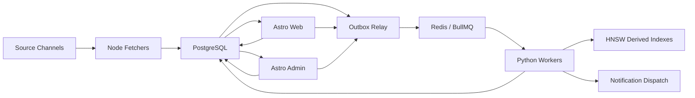

# Master Blueprint: zero-shot система фильтрации, персонализации и нотификаций контента

## Runtime-core summary

Этот документ остается главным human-readable source of truth для NewsPortal. Разделы ниже содержат полный master blueprint; текущий summary нужен как быстрый reload для runtime core и должен читаться вместе с детальными разделами ниже, а не вместо них.

### Назначение системы

NewsPortal строится как zero-shot система фильтрации, персонализации, event clustering и нотификаций контента для одного B2C white-label-ready продукта на рынках USA и Евросоюза.

### Product meaning

Система должна принимать поток контента из нескольких типов источников, нормализовать и дедуплицировать content items, находить совпадения по system interests и user interests без retrain, объяснимо доставлять важные элементы пользователю и сохранять управляемую эксплуатационную стоимость.

### Technical model

- polyglot monorepo с Astro apps, Node fetch/relay services и Python NLP/indexing services;
- PostgreSQL как единственный source of truth;
- Redis + BullMQ только как transport layer;
- HNSW indices, snapshots, model cache и прочие derived artifacts пересобираемы;
- shared contracts, SDK, UI и config вынесены в `packages/*`.

### Operating model

Основной путь данных выглядит так:

`source channel -> Node fetcher -> PostgreSQL -> outbox_events -> relay -> (q.fetch/q.foundation.smoke fallback or sequence lookup -> sequence_runs -> q.sequence) -> Python workers/task engine -> PostgreSQL/HNSW derived state -> Astro web/admin, API и notification dispatch`

Главный write principle: пользовательский и сервисный command path сначала фиксирует бизнес-изменение в PostgreSQL, затем публикует outbox event; тяжелая обработка выполняется асинхронно worker-ами, а UI читает результат из PostgreSQL.

Sequence-engine rollout truth: `services/workers/app/task_engine` теперь является default runtime owner для sequence-managed triggers (`article.ingest.requested`, `interest.compile.requested`, `criterion.compile.requested`, `llm.review.requested`, `notification.feedback.recorded`, `reindex.requested`). Relay для них создает PostgreSQL-backed `sequence_runs` и enqueue-ит `q.sequence`, а fallback direct queue fanout остается только для non-sequence events вроде `foundation.smoke.requested` и `source.channel.sync.requested`; если sequence-managed event не имеет active sequence route, relay должен fail-ить outbox row вместо silent skip.

Discovery rollout truth: discovery source acquisition теперь живет на `0016_adaptive_discovery_cutover.sql` и остается внутри того же maintenance/UTE boundary. `discovery_missions.interest_graph` является authoritative planning state и operational working memory для mission planning, `discovery_hypothesis_classes` является authoritative registry для hypothesis classes, а adaptive loop persists `discovery_hypotheses`, `discovery_candidates`, `discovery_source_profiles`, `discovery_source_interest_scores`, `discovery_portfolio_snapshots`, `discovery_feedback_events`, `discovery_strategy_stats` и `discovery_cost_log`; source evaluation остается явной парой `Source Profile × Interest`, где глобальные trust/quality signals живут в `discovery_source_profiles`, а mission-scoped fit/novelty/coverage в `discovery_source_interest_scores`, но stage-5 decoupling requires discovery channel-quality inputs to come from generic intake signals such as unique-article ratio, fetch health, freshness, lead-time, and duplication pressure rather than downstream selected-content outcomes like `system_feed_results` or `final_selection_results`. The current compose/dev baseline also carries a repaired discovery migration path for historical 0016 drift: `0026a_discovery_schema_drift_prerepair.sql` heals drifted databases before `0027_independent_recall_quality_foundation.sql`, while `0030_discovery_schema_drift_repair.sql` restores the remaining 0016 discovery-core tables/constraints idempotently and works together with strengthened migration smoke that now asserts the full discovery core rather than only later additive tables. Independent-recall stage-1 now also persists additive `discovery_source_quality_snapshots`: existing discovery execution and re-evaluation materialize generic recall/source-quality truth per source profile/channel independently from mission-fit scoring, and maintenance API exposes `/maintenance/discovery/source-quality-snapshots*` for that new layer. Independent-recall stage-2 now also persists additive `discovery_recall_missions` and `discovery_recall_candidates`: maintenance API exposes `/maintenance/discovery/recall-missions*` and `/maintenance/discovery/recall-candidates*`, recall candidates can link themselves to existing `discovery_source_profiles` plus latest `discovery_source_quality_snapshots` by canonical domain, and neutral recall state no longer requires `interest_graph` or hypothesis classes just to exist. Independent-recall stage-3 now also ships bounded recall-first acquisition for `rss` and `website`: worker orchestration can search/probe neutral recall missions via `/maintenance/discovery/recall-missions/{recall_mission_id}/acquire`, persist additive recall candidates plus generic quality snapshots without `interest_graph`, and reuse shared `discovery_source_profiles` by canonical domain. Independent-recall stage-4 now also ships bounded promotion from recall candidates into `source_channels`: `POST /maintenance/discovery/recall-candidates/{recall_candidate_id}/promote` reuses the same PostgreSQL + outbox `source.channel.sync.requested` discipline as graph-first discovery, persists `registered_channel_id` on the recall candidate, and links the shared source profile to the promoted channel when possible. Independent-recall stage-5 now also ships the operator/read-model closeout: discovery summary counts promoted and duplicate recall candidates, source-profile reads surface the latest additive generic quality snapshot, and admin/help discovery surfaces now distinguish mission fit, generic source quality, neutral recall backlog, and recall-promotion state instead of collapsing them into one score. These additive layers still do not replace graph-first mission planning, but source onboarding is no longer owned only by mission/hypothesis review, and shipped discovery runtime is now a bounded dual-path control plane rather than a graph-first-only onboarding owner. Worker-side orchestration по-прежнему создает child `sequence_runs` через task-engine repository layer, current execution baseline remains bounded to reusable RSS and website child sequences rather than API/IMAP/YouTube discovery channels, live search defaults to DDGS while `DISCOVERY_ENABLED=false` keeps the runtime dormant by default, admin read/write surfaces stay under FastAPI plus Astro same-origin BFF `/maintenance/discovery/*`, website probing for JS-heavy candidates now calls the fetchers-owned internal endpoint instead of owning browser logic in Python, deep discovery truth now lives in `docs/contracts/discovery-agent.md` and `docs/contracts/independent-recall-discovery.md`, and approved candidates now reach `source_channels` through the existing graph-first mission/hypothesis review path or the new bounded recall-candidate promotion path, both of which still emit PostgreSQL-backed `source.channel.sync.requested` outbox events.

Extractus ingest truth: `services/fetchers` теперь parse-ит RSS/ATOM/JSON Feed через extractus adapter, сохраняет richer feed metadata в `raw_payload_json`, а active article sequence по-прежнему стартует от `article.ingest.requested`, но первым task внутри него исполняет fetchers-owned `enrichment.article_extract` до `article.normalize`. RSS channels при этом могут использовать внутренние feed-ingress adapters (`generic`, `reddit_search_rss`, `hn_comments_feed`, `google_news_rss`) внутри того же `provider_type = rss` boundary: explicit `config_json.adapterStrategy` wins, otherwise runtime inference keys off `fetch_url`; adapter layer может выполнять tolerant parse path, canonical target URL normalization, Google-wrapper resolution, HN discussion provenance capture и pre-ingest stale-entry drop via `maxEntryAgeHours`, но не должен silently превращать агрегатор в новый provider type. Fetchers polling now also takes a per-channel PostgreSQL advisory lease before polling so the same `source_channel` cannot be processed concurrently across the periodic poll loop and manual/specialized poll entry points. Worker-side fetchers enrichment adapters now also apply bounded retry semantics for short-lived internal transport failures and retryable gateway statuses before failing the sequence task, so brief fetchers restarts do not immediately become permanent article/resource run failures. Local compose truth for this lane also remains image-based for `worker` and `fetchers` rather than source bind-mounted, so repo-side Python/Node runtime changes inside those services do not affect the live stack until the relevant services are rebuilt and restarted. Этот pre-normalize step через internal fetchers endpoint владеет full-article extraction, enrichment metadata и `article_media_assets`/`primary_media_asset_id`/`has_media`, тогда как manual admin retry для failed/skipped enrichment идет через FastAPI maintenance path, который создает manual `sequence_run` на том же active article pipeline и dispatch-ит его в `q.sequence`; fetchers-side timestamp sanitization now also rejects malformed non-persistable extracted dates such as year-zero `0000-...` inputs before DB persistence instead of failing the whole enrichment run. The shipped zero-shot selection lane now consists of additive `canonical_documents`, `document_observations`, `story_clusters`, `story_cluster_members`, `verification_results`, `interest_filter_results`, and `final_selection_results`: fetchers persist raw article observations at ingest time, worker dedup materializes canonical-document ownership after article normalization/dedup, worker `article.cluster` materializes canonical-first story clustering plus verification state, worker matching/review paths materialize explicit technical-vs-semantic filter outcomes plus verification snapshots, and worker-side final-selection helpers now persist bounded generic candidate-signal explainability in `interest_filter_results.explain_json` so document-level positive/noise cues, hit counts, and canonical/story-context-backed uplift decisions remain visible without source-level gating. Criterion-scope LLM review is now canonical-reuse-aware: before enqueueing a fresh `llm.review.requested`, worker can reuse the latest resolved review for the same `canonical_document_id + criterion_id`, write reuse metadata back into the current article-level explain/filter rows, and avoid spending the same review budget on each duplicate observation. Candidate-uplift semantics are now runtime-owned by admin-managed criterion/profile data instead of hardcoded outsourcing vocabulary in worker constants: the generic engine applies one uplift algorithm, while criterion- or profile-specific cue groups travel through `selection_profiles.definition_json` / compiled criterion state and remain visible in explain payloads as cue-source metadata; the generic fallback itself is intentionally limited to structural request/change/procurement cues and no longer treats weak ranking/listicle wording such as `top`, `best`, or generic `options` as sufficient candidate evidence. The active outsourcing LLM-review bundle is now also criterion-grounded by scope: the live `criteria` prompt must anchor on the current `criterion_name` instead of using one universal build-only buyer-intent frame, while `interests` and `global` prompts remain separately scoped and versioned in `llm_prompt_templates`; runtime truth for those prompts lives in admin-managed DB rows, `EXAMPLES.md` Example C is the primary operator-facing guide for the built-in outsourcing bundle, `docs/data_scripts/outsource_balanced_templates.md` remains only a focused outsourcing companion, and the adjacent JSON asset remains only a legacy/manual reference. Worker personalization gating now consults `final_selection_results` first before any compatibility fallback, and historical backfill proof explicitly clears/rebuilds derived rows before reconciling bounded `system_feed_results` projection while the universal-profile migration lane now also records the active `selectionProfileSnapshot` for `backfill` / `repair` replay provenance. Operator-facing article/detail/explain surfaces must present raw article rows as observations and expose canonical-document, story-cluster, verification, and final-selection context explicitly instead of collapsing those truths back into `articles.processing_state`; shipped operator surfaces now also expose human-readable final-selection summaries, reasons, normalized `selection_*` payloads, `hold` vs `pending review` counts, generic diagnostics aggregated from `interest_filter_results`, `llm_review_log`, and `notification_log`, recovered-candidate counters/summaries for bounded candidate-signal uplift cases, explicit recovered-candidate absence/presence state for the current item, canonical-review-reuse and canonical-selection-reuse summaries, and maintenance reindex reads that expose which `selection_profiles` snapshot historical repair used without requiring fixed domain taxonomies. Public/admin/API selected-content read surfaces now prefer `final_selection_results` and only fall back to `system_feed_results` while a final-selection row is absent; when exact article-level selection truth is missing, the same read/gating layer may reuse canonical-sibling final-selection or compatibility verdicts so duplicate article rows do not inflate selected winners on canonical-first surfaces while article-level provenance remains persisted. Deep subsystem truth for this lane lives in `docs/contracts/feed-ingress-adapters.md`, `docs/contracts/zero-shot-interest-filtering.md`, and the profile-semantics evolution contract `docs/contracts/universal-selection-profiles.md`; current runtime still uses compatibility `interest_templates` / `criteria` semantics for scoring, but the shipped profile evolution now also persists additive `selection_profiles`, keeps admin system-interest writes synced into that explicit profile layer, defaults compatibility system-interest profiles to explicit `llmReviewMode = always` while other profile-backed unresolved criteria still cheap-hold unless policy opts into review, repairs historical compatibility rows through migration `0033_compatibility_profile_llm_review_defaults.sql`, and makes `final_selection_results` plus bounded `system_feed_results` distinguish true LLM-pending gray-zone cases from cheap profile-backed holds.

Universal ingress convergence truth: `rss`, `website`, `api`, `email_imap`, and any future ingestable provider may differ only inside provider-owned acquisition/adaptation before handoff. После этой границы все ingestable content items обязаны входить в один и тот же общий downstream path через `article.ingest.requested`; provider-specific pre-handoff triggers like `resource.ingest.requested` допустимы только как acquisition-only adapters and must not create parallel clustering/filtering/selection/read-model pipelines. Provider-native storage may remain as acquisition/evidence/diagnostics truth, but product, personalization, clustering, verification, interest filtering, final selection, and user/admin selected-content read models must converge on the same article/downstream truth after handoff.

Universal web-ingestion truth: `website` больше не трактуется как thin alias к одной HTML-странице или как RSS auto-conversion path. Fetchers теперь используют additive `web_resources` acquisition/evidence layer, `crawl_policy_cache`, provider-agnostic `WebsiteChannelConfig`, multi-cursor website semantics (`timestamp`, `lastmod`, `set_diff`, `content_hash`) и dedicated sequence-managed trigger `resource.ingest.requested`; website polling остается cheap discovery loop (`sitemap -> feed -> collection -> inline_data -> download`) с rough classification, dedup и persistence, а typed extraction живет в fetchers-owned `enrichment.resource_extract` path. Любой ingestable website resource после extraction обязан либо project-иться в общий `articles` downstream contract c persisted `content_kind` и trigger-ом `article.ingest.requested`, либо truthfully фиксироваться как explicit pre-pipeline rejection; product-success path “resource сохранился, но downstream handoff не случился” больше не является допустимой truth-моделью. `crawl_policy_cache` now also owns domain-scoped conditional-request validator/cache state for `homepage`, `robots`, `llms`, and discovered sitemap/feed URLs, while `channel_fetch_runs.provider_metrics_json` is the canonical per-run website telemetry surface for `staticAcceptedCount`, `browserAttempted`, `browserOnlyAcceptedCount`, `resourceKindCounts`, `conditionalRequestHits`, and downstream handoff counters. Browser-assisted handling for JS-heavy / soft anti-bot websites теперь тоже принадлежит fetchers boundary: it is opt-in via `browserFallbackEnabled`, bounded by `maxBrowserFetchesPerPoll`, limited to rendered-DOM plus same-origin network capture, records additive provenance/challenge signals, and must not add login/CAPTCHA bypass logic or silently convert website sources into RSS. Fetcher-side per-channel auth для operator-ready `rss` и `website` now lives in `source_channels.auth_config_json` as an optional static raw `Authorization` header; `config_json` остается non-secret provider config, public/admin read models expose only safe summary like `has_authorization_header`, and website auth injection must stay same-origin-only across both cheap/static requests and browser-assisted fallback rather than using context-wide browser headers. После handoff product and selection truth является общей с RSS: clustering, verification, interest filtering, final selection, personalization, и selected-content read models читают только article/downstream truth, а `web_resources` остаются operator-facing acquisition diagnostics with classification/projection telemetry. Hidden feeds остаются discovery hint/optimization, но не canonical provider switch, `web_resources.classification_json` now preserves additive `discovery` / `enrichment` / `resolved` / `transition` classifier truth, and `attributes_json.editorialExtraction` keeps bounded post-discovery `article-extractor` gating plus body-uplift telemetry without broadening extractor usage into acquisition. Admin/operator website onboarding plus resource observability (`/maintenance/web-resources*`, `/admin/resources*`) теперь являются first-class acquisition surfaces вместо параллельной product read-model ветки. Deep subsystem truth for this lane lives in `docs/contracts/browser-assisted-websites.md`.

### Capability model

Долговременная capability-модель системы разбита на пять линий развития:

- platform foundation;
- ingest foundation;
- NLP foundation;
- matching and notification;
- explainability and operations.

Эти линии могут реализовываться по stages, но их архитектурный смысл должен оставаться стабильным.

### Core invariants

- PostgreSQL является единственным source of truth для критичных бизнес-данных.
- Redis и BullMQ используются только как transport, coordination и retry layer.
- Система остается zero-shot only: без online learning, retrain по кликам и training pipeline.
- Тяжелая NLP/matching logic не уходит в frontend runtimes и не становится sync internal REST path.
- Derived state обязан быть rebuildable из PostgreSQL.

### Boundary map

- UI/BFF и пользовательские команды отделены от тяжелой асинхронной обработки.
- Authenticated `apps/web` и `apps/admin` surfaces могут использовать app-local same-origin polling через `/bff/*` и `/admin/bff/*` для bounded freshness уже записанной PostgreSQL truth, но этот слой остается тонкой read UX-надстройкой, а не новым processing transport или live-streaming full tables.
- PostgreSQL truth отделен от derived state в HNSW, snapshots, cache и queue state.
- Node fetch/relay responsibilities отделены от Python NLP/indexer responsibilities.
- Public/read API и explain surfaces отделены от внутреннего pipeline orchestration.

### Structural rules

- `apps/*` содержат только Astro product surfaces.
- `services/fetchers` и `services/relay` несут Node/TypeScript ingest and routing responsibilities.
- `services/api`, `services/workers`, `services/ml`, `services/indexer` несут Python read, processing, ML и rebuild responsibilities.
- `services/workers/app/task_engine` теперь несет default runtime ownership для sequence-managed triggers; legacy typed queue consumers остаются только opt-in compatibility path и не должны silently работать рядом с default sequence runtime.
- `packages/*` хранят shared contracts, SDK, UI primitives и config.
- `database/*` хранит DDL, migrations и seeds; `infra/docker/*` задает официальный Compose baseline.
- Queue payload design остается тонким и ID-based.

### Forbidden shortcuts

- Нельзя вводить SQLite как основную БД.
- Нельзя использовать `pgvector` как primary ANN baseline.
- Нельзя превращать внутренний REST между Astro/Node и Python в основной heavy-processing transport.
- Нельзя класть большие article payload в очереди.
- Нельзя переносить тяжелую NLP/matching logic в frontend runtime.
- Нельзя допускать неконтролируемые admin operations без аудита.

### Risk zones

- Queue consistency и outbox/inbox semantics: риск потери событий, дублирующей обработки и рассинхронизации статусов; минимум proof — relay/migration/worker smoke на реальном пути PostgreSQL -> BullMQ -> consumer.
- Derived indices и compiled state: риск drift между PostgreSQL и HNSW-derived слоями; минимум proof — targeted rebuild/check commands и smoke pipeline вокруг embeddings, clustering или compile flow.
- Auth/session bridge и notification delivery: риск сломанного пользовательского command/read path между Astro, API и dispatch layer; минимум proof — targeted endpoint и compose-level validation для затронутой поверхности.
- Gray-zone LLM review и suppression: риск ложных решений и непрозрачной логики в чувствительной зоне; минимум proof — targeted worker smoke плюс честная фиксация residual gaps.

### Связанные runtime-core документы

- `docs/engineering.md` хранит durable engineering discipline: decomposition rules, boundary-handling, refactor honesty, stateful test access и cleanup expectations.
- `docs/verification.md` хранит proof policy, gate taxonomy и close gate.
- `docs/architecture-overview.md` дает быстрый current-state walkthrough с диаграммами для ingest, selection, maintenance replay и discovery dual-path behavior.
- `docs/contracts/article-pipeline-core.md` фиксирует практические guardrails для уже shipped article/selection pipeline core: ingest-to-selection ownership, canonical review/selection reuse, safe tuning layers и preserve-set discipline for truthful local resets.
- `docs/contracts/test-access-and-fixtures.md` является текущим deep contract doc для stateful backend testing, Firebase identities, Mailpit delivery, `web_push` subscriptions и persistent fixture cleanup.
- `docs/contracts/universal-task-engine.md` хранит durable contract для staged Universal Task Engine migration, sequence data model, executor/plugin boundaries и cutover discipline.

Остальная часть документа ниже остается детальным, долговременным архитектурным reference без радикального переписывания под runtime-core summary.

## 1. Назначение документа

Этот документ является сводным master blueprint для проектирования и реализации системы zero-shot фильтрации новостей, event clustering, персонализации и нотификаций.

Цель документа:

- зафиксировать итоговые архитектурные решения;
- снять противоречия между версиями;
- описать полный целевой baseline системы;
- дать основу, по которой можно проектировать БД, сервисы, очереди, API, UI и deployment;
- явно отделить принятые решения от открытых вопросов.

Этот документ должен считаться главным reference-документом для дальнейшего проектирования.

---

## 2. Итоговые архитектурные решения

Ниже зафиксированы решения, которые считаются финальными для текущей версии blueprint.

| Тема | Встречавшиеся варианты | Финальное решение |
| --- | --- | --- |
| Основная БД | SQLite, PostgreSQL | PostgreSQL как единственный source of truth |
| Full-text search | SQLite FTS5, Postgres FTS | PostgreSQL Full-Text Search |
| ANN слой | hnswlib, местами `pgvector` | `hnswlib` как основной derived ANN слой; `pgvector` не обязателен |
| Frontend | Next.js, Astro | Astro для `web` и `admin` |
| Fetching слой | Python fetchers, Node fetchers | Node/TypeScript fetchers |
| NLP и matching | смешанный слой, Python | Python runtime |
| Межсервисный transport | внутренний REST, очередь | Redis + BullMQ / BullMQ Python |
| Консистентность | прямой enqueue, разные варианты | PostgreSQL + outbox relay + inbox/idempotency |
| Репозиторий | разрозненные сервисы, монорепо | Polyglot monorepo |
| Deployment baseline | systemd only, Compose addendum | Docker Compose как основной single-host baseline с подготовкой к будущему разделению по нескольким машинам |
| Product mode | single product, multi-product, white-label | Single-tenant B2C white-label-ready архитектура для одного продукта с полным white-label scope |
| Sources baseline | разные варианты | RSS, websites, IMAP-polled email feeds, external APIs; YouTube закладывается как first-class future provider; browser-heavy fetchers не обязательны в MVP |
| Language and market coverage | частичная мультиязычность | Английский, украинский и языки рынков ЕС; приоритетные рынки USA и Евросоюз |
| Auth | локальный auth, Firebase | Firebase Auth подтвержден как baseline auth layer; в MVP пользовательский вход анонимный, admin использует неанонимную Firebase identity + локальную роль |
| UI system | custom UI, native browser controls, mixed | `packages/ui` строится на `shadcn/ui`; в `web` и `admin` запрещены raw browser-default controls на продуктовых экранах |
| Theme model | light/dark only, white-label only | Три режима темы: `light`, `dark`, `system(native)`; white-label branding накладывается поверх общих design tokens |
| Content model | text-only news, media later | Контент-модель media-capable с первого этапа: текст, изображения, видео, embed metadata; пригодна для будущих video-first источников |
| Moderation and engagement | passive read-only admin | Admin может блокировать/разблокировать новости, видеть per-article like/dislike counters и KPI dashboard |
| Notification channels | разные варианты | Web push и Telegram для immediate alert delivery; `email_digest` хранит verified recipient для manual saved digests и scheduled personalized digests |
| Gray zone policy | manual review, no LLM, optional LLM | Автоматический асинхронный LLM-review для gray zone с admin-configurable prompt через внешний LLM API |
| External integration | internal only, none | Публичное API обязательно и покрывает клиентские сценарии |
| Feedback | none, analytics later | Feedback `helpful / not_helpful` хранится с первого этапа для будущей дополнительной персонализации |

---

## 3. Что строим

Система строится с нуля и должна:

- работать как white-label-ready платформа для одного B2C продукта без multi-tenancy;
- принимать поток статей из множества источников и каналов;
- нормализовать и дедуплицировать статьи;
- определять `exact duplicate`, `near duplicate`, `same event`, `same topic`;
- делать zero-shot matching статьи к системным критериям;
- делать zero-shot matching статьи к интересам пользователей;
- позволять пользователю менять интересы без retrain и без обучения модели;
- поддерживать media-rich новости с изображениями, видео и embed-метаданными без переделки доменной модели;
- отправлять нотификации по новым событиям и major updates;
- иметь пользовательский интерфейс и административный интерфейс;
- иметь минимальный moderation baseline: block/unblock новости, аудит действий и метрики по реакциям;
- быть рассчитанной на single-host deployment;
- быть дешевой в эксплуатации;
- быть CPU-friendly;
- использовать open-source NLP stack там, где это возможно;
- быть пригодной для поэтапного вывода в production.

На старте система ориентирована на:

- B2C аудиторию;
- один продукт;
- single-tenant deployment model;
- рынки USA и Евросоюза;
- английский язык, украинский язык и языки целевых рынков ЕС.

Система проектируется под средний масштаб:

- до 100k статей в сутки как комфортный baseline;
- 100k-300k пользователей как целевой диапазон первой production-итерации;
- 2-5 активных interest blocks на пользователя как нормальный режим.

---

## 4. Границы системы

### 4.1. Что входит в систему

- white-label branding/config слой для одного продукта;
- registry источников и каналов;
- fetchers и ingest orchestration;
- хранение content items и их признаков;
- zero-shot matching и event clustering;
- compiled system interests и compiled user interests;
- admin `interest_templates` materialize-ятся в live system-interest rules for fresh ingest and historical reindex, при этом персональные `user_interests` остаются отдельным per-user match layer и могут редактироваться из admin только через явный on-behalf flow для выбранного пользователя по `email` или `user_id`;
- storage-level `final_selection_results` now remains the primary internal implementation detail for editorial final selection, while `system_feed_results` is kept as a compatibility projection during the cutover; canonical public/system truth above them remains the `system-selected collection` and `content_item` surfaces;
- user-facing web surfaces теперь разделены truthfully: `/` остается global `system-selected collection`, `/matches` page показывает только per-user personalized matches поверх уже допущенного system gate, `/saved` хранит user-owned read-later queue for manual digest building, а `/following` показывает latest selected article per followed editorial story cluster;
- notification decisioning;
- suppression и anti-spam;
- хранение пользовательского feedback по алертам;
- user web app;
- admin app;
- public API для внешних клиентов;
- explainability screens;
- media metadata и media rendering contract для новостей;
- article reactions `like / dislike`;
- admin dashboard KPI и lightweight moderation;
- reindex и rebuild tooling;
- single-host deployment baseline.

### 4.2. Что не входит в baseline

- обучение на кликах;
- user embeddings, обученные по поведению;
- recommendation engine на основе collaborative filtering;
- multi-tenant isolation model;
- Kubernetes;
- service mesh;
- распределенный multi-region deployment;
- выделенная vector DB как обязательный компонент;
- LLM в основном ingest path;
- browser-heavy anti-bot fetching как обязательная часть MVP;
- богатый ручной moderation workflow сверх простого `block/unblock` новости как обязательная часть MVP.

---

## 5. Жесткие ограничения и принципы

### 5.1. Zero-shot only

Система не использует:

- обучение моделей на поведении;
- дообучение на пользовательских кликах;
- online learning;
- train pipeline;
- retrain при каждом изменении интересов.

Разрешено:

- embeddings;
- правила;
- полнотекстовый поиск;
- дедупликация;
- ANN поиск;
- фиксированные формулы скоринга;
- ручные пороги;
- explainable heuristics.

### 5.2. PostgreSQL как источник истины

Все критичные бизнес-данные фиксируются в PostgreSQL.

Вне PostgreSQL допускаются только производные данные:

- HNSW индексы;
- snapshot-файлы индексов;
- локальные модели и ONNX artifacts;
- временные batch-артефакты;
- очереди;
- cache;
- runtime leases и ephemeral state.

### 5.3. Нет внутреннего REST между Node и Python как основного протокола

Node/Astro и Python не должны синхронно дергать друг друга по REST на каждую тяжелую операцию.

Причины:

- выше связность;
- хуже backpressure;
- хуже retries;
- сложнее batching;
- сложнее контролировать write path;
- тяжелые CPU-задачи начинают блокировать пользовательский слой.

### 5.4. Redis и BullMQ только как transport

Redis не является источником истины.

Он используется для:

- транспортного слоя очередей;
- delayed jobs;
- retries;
- queue state;
- lightweight coordination;
- rate limiting;
- optional locks.

### 5.5. Минимизация цены

Нужно минимизировать:

- число вызовов embedding модели;
- число сравнений документ -> все пользователи;
- число больших payload в очередях;
- количество сервисов;
- объем derived state;
- количество тяжелых сетевых hops.

### 5.6. Derived state всегда пересобираем

Если HNSW, кеши или очереди сломались, бизнес-данные не должны теряться.

Система должна штатно поддерживать:

- rebuild индексов;
- backfill embeddings;
- recompile interests;
- recompile criteria;
- replay outbox;
- re-drive failed jobs.

### 5.7. LLM только в контролируемой серой зоне

LLM допускается только как асинхронный слой для gray zone и не должен заменять основной zero-shot path.

Разрешенный режим:

- авто-review только для кейсов, попавших в серую зону;
- отдельная очередь и отдельный decision log;
- prompt и policy настраиваются из admin UI;
- prompt version должен храниться вместе с решением;
- вызов идет только во внешний LLM API provider;
- LLM решение не должно блокировать ingest и основной write path.

LLM не должен быть обязательным шагом для каждой статьи.

### 5.8. Single-tenant white-label baseline

Система проектируется как single-tenant B2C продукт, но должна сохранять простой white-label слой:

- branding config;
- theme tokens;
- product copy/config;
- notification branding;
- public API branding/versioning;
- отдельные наборы источников;
- prompt templates;
- notification rules;
- digest templates.

Полная multi-tenant модель в baseline не требуется.

### 5.9. Feedback и article reactions хранятся, но не участвуют в baseline scoring

С первого этапа нужно сохранять:

- пользовательский feedback по алертам;
- пользовательские реакции на новости `like / dislike`.

В baseline эти сигналы:

- не используются для обучения модели;
- не встраиваются в текущий zero-shot score;
- не меняют dedup, clustering и matching-решения напрямую;
- хранятся для будущей дополнительной персонализации, аналитики, quality review и rule tuning.

### 5.10. UI policy: только `shadcn/ui`-based product components

Для `web` и `admin` фиксируется следующий baseline:

- все кнопки, поля ввода, select, checkbox, switch, dialog, drawer, table, tabs, toast, dropdown и прочие product UI controls приходят из `packages/ui`, собранного поверх `shadcn/ui`;
- нативные HTML элементы допустимы только как внутренности этих компонентов или как чисто семантическая разметка контента;
- на продуктовых экранах не должно быть browser-default styling у контролов;
- стилизация должна идти через общие design tokens и CSS variables, а не ad-hoc inline styling на уровне приложений.

### 5.11. Theme model: `light`, `dark`, `system(native)`

Тема должна работать одинаково в `web` и `admin`.

Базовые правила:

- пользовательский выбор хранится как `light | dark | system`;
- `system` означает следование системной теме устройства/браузера;
- brand tokens и white-label overrides должны быть совместимы со всеми тремя режимами;
- темы не должны расходиться по составу компонентов, меняются только tokens, semantic colors, elevation и media treatment.

---

## 6. Нефункциональные требования

Система должна быть:

- explainable;
- идемпотентной;
- восстановимой после сбоя;
- single-host friendly;
- наблюдаемой;
- пригодной для постепенного масштабирования;
- дешевой в сопровождении;
- безопасной с точки зрения ролей, секретов и административных операций.

Ключевые эксплуатационные свойства:

- новая статья должна проходить pipeline асинхронно;
- UI не должен ждать завершения NLP-операций;
- queue payload не должен тащить большие тексты;
- любой шаг должен быть retry-safe;
- изменение user interest не должно требовать retrain;
- сбой derived state не должен портить source data;
- у системы нет жесткого SLA на мгновенную доставку alert в MVP;
- архитектура должна позволять позже разнести runtime по нескольким машинам без полной переделки доменной модели.

---

## 7. Логическая архитектура

Система состоит из следующих слоев:

1. Frontend layer
2. Command and orchestration layer
3. Core storage layer
4. Fetching layer
5. NLP and matching layer
6. Notification layer
7. Rebuild and maintenance layer
8. Observability and operations layer

### 7.1. Поток данных



### 7.2. Главный архитектурный принцип

Пользовательский слой пишет команду в PostgreSQL, а не вызывает тяжелую логику напрямую.

Правильная модель:

- browser -> Astro;
- Astro -> PostgreSQL transaction;
- transaction -> outbox event;
- relay -> BullMQ job;
- worker -> heavy processing;
- worker -> PostgreSQL result;
- UI читает результат из PostgreSQL.

---

## 8. Технологический стек

### 8.1. Frontend

- Astro
- TypeScript
- React islands для интерактивных зон; route-level React islands допустимы для form-heavy и dashboard-heavy экранов
- Tailwind CSS
- `shadcn/ui` как единый baseline для product components через shared `packages/ui`
- shared UI package
- generated TypeScript SDK для API/контрактов

### 8.1.1. UI и design-system baseline

- `packages/ui` является единственным источником UI primitives для `web` и `admin`;
- `packages/ui` собирается из `shadcn/ui`-компонентов и их project-specific wrappers;
- дизайн должен быть editorial + dashboard oriented: премиальный, плотный, современный, но без визуального шума;
- все формы, фильтры, таблицы, карточки, drawers, media blocks и dashboard widgets должны использовать единый токенизированный стиль;
- news cards и detail screens должны штатно поддерживать text-only, image-first и video-first presentation;
- переходы, skeleton states и empty states должны быть частью дизайн-системы, а не локальными исключениями.

### 8.1.2. Theming и branding

- три поддерживаемых режима: `light`, `dark`, `system(native)`;
- базовые токены: `background`, `foreground`, `muted`, `accent`, `border`, `ring`, `card`, `popover`, `destructive`, `success`, `warning`;
- white-label слой может переопределять brand palette, typography accents, radius и imagery style, не ломая accessibility и layout density;
- theme resolution должна быть одинаковой для SSR и hydrated islands, чтобы не было flash of wrong theme.

### 8.2. Auth

Рекомендуемый baseline:

- Firebase Authentication для browser auth;
- Firebase Anonymous Auth как основной user entry point в MVP;
- Firebase Web SDK на клиенте;
- Firebase Admin SDK в Node/Astro runtime для проверки ID token и session cookie;
- PostgreSQL для локального профиля, ролей, настроек и business data.

Важное ограничение:

- Firebase Auth считается подтвержденным baseline;
- anonymous users поддерживаются только для конечных пользователей, не для admin routes;
- public Python API остается единственным владельцем `/api/*`, а Astro browser/session/BFF surfaces живут в app-local namespace `/bff/*`; production ingress мапит `web` на `/`, `admin` на `/admin/`, поэтому admin browser/BFF paths снаружи выглядят как `/admin/bff/*`;
- authenticated `web` UX может читать компактные user-bound freshness snapshots через same-origin `/bff/live-updates`, чтобы hydrated islands обновляли compile/repair status, counts и refresh prompts без ручного full-page reload; этот polling path не заменяет public `/api/*` и не становится каналом для тяжелой обработки;
- admin auth использует dedicated sign-in surface `/sign-in` (снаружи `/admin/sign-in` за nginx ingress); unauthenticated admin page requests обязаны редиректить туда с `next=<requested-path>` и не должны рендерить dashboard shell поверх auth form;
- Astro BFF write routes в `web` и `admin` обязаны различать browser navigation и scripted/API clients: HTML form flow использует `303` Post-Redirect-Get redirect с flash status/message на наиболее релевантный browser-visible экран (dedicated sign-in, текущий list screen или entity edit screen), auth failures чистят stale session cookie, а non-navigation clients сохраняют machine-readable JSON semantics;
- доменные сущности не должны зависеть от Firebase-специфичных таблиц сильнее, чем через `auth_subject`;
- при необходимости auth provider можно будет заменить через adapter слой без ломки бизнес-сущностей.

### 8.3. Node runtime

- Node.js LTS
- BullMQ
- Prisma только как удобный typed client для части CRUD в Node-слое, но не как владелец схемы
- raw SQL там, где нужны advanced Postgres features
- Playwright
- Crawlee

### 8.4. Python runtime

- Python 3.11+
- FastAPI для thin read/debug API
- SQLAlchemy 2.x
- Alembic
- Pydantic
- sentence-transformers
- ONNX/OpenVINO backend
- fastText lid.176
- datasketch
- simhash
- hnswlib

### 8.5. Storage

- PostgreSQL 16+
- PostgreSQL Full-Text Search
- `hnswlib` как derived ANN слой
- файловые snapshots индексов

### 8.6. Ops

- Docker Compose
- Nginx
- structured JSON logs
- health endpoints
- optional Prometheus/Grafana на следующем этапе

### 8.7. Что не требуется в baseline

- pgvector как обязательный компонент;
- отдельная vector DB;
- Kafka;
- Kubernetes;
- distributed tracing stack как hard requirement.

`pgvector` можно добавить позже для диагностики, small-scale similarity experiments или миграционного слоя, но не как основной ANN baseline.

---

## 9. Монорепозиторий

### 9.1. Почему нужен монорепозиторий

Монорепо нужно, чтобы в одном месте держать:

- `web`;
- `admin`;
- Node fetchers;
- relay;
- Python workers;
- Python ML library;
- shared contracts;
- shared UI;
- миграции;
- Docker/infra;
- документацию;
- scripts и reindex tooling.

Это дает:

- единый CI/CD;
- единый source of truth по контрактам;
- согласованную структуру типов;
- проще локальный запуск;
- проще релизы.

### 9.2. Целевая структура

```text
/news-platform/
  apps/
    web/
    admin/
  services/
    fetchers/
    relay/
    api/
    workers/
    ml/
    indexer/
  packages/
    ui/
    contracts/
    sdk/
    config/
  database/
    migrations/
    ddl/
    seeds/
  infra/
    docker/
    nginx/
    systemd/
    scripts/
  data/
    models/
    indices/
    snapshots/
    logs/
  docs/
  package.json
  pnpm-workspace.yaml
  turbo.json
  README.md
```

### 9.3. Ответственность каталогов

#### `apps/web`

- анонимный вход в MVP и последующий account linking как future capability;
- управление interest blocks;
- просмотр system-selected collection и personalized `/matches`;
- просмотр media-rich content cards/detail, включая internal content detail route `/content/{content_item_id}`;
- реакции `like / dislike` на editorial content;
- история нотификаций;
- переключение темы `light / dark / system`;
- пользовательские настройки;
- job status/read models.

#### `apps/admin`

- dedicated admin sign-in screen и session-aware shell;
- channels и providers;
- dedicated list/create/edit CRUD flows для channels, LLM prompt templates и interest templates;
- dashboard KPI;
- health pages;
- queue status;
- ingest errors;
- block/unblock новостей;
- просмотр like/dislike counters по каждой новости;
- explain screens;
- clusters;
- suppression logs;
- reindex/replay actions.

#### `services/fetchers`

- RSS fetchers;
- HTTP/HTML fetchers;
- browser fetchers;
- Crawlee pipelines;
- anti-bot browser flows;
- запись raw article;
- запись outbox events.

#### `services/relay`

- чтение `outbox_events`;
- публикация job в BullMQ;
- обновление статуса доставки;
- re-drive failed publishing.

#### `services/api`

- health endpoints;
- debug endpoints;
- explain read endpoints;
- internal read helpers.

Python API не должен становиться главным sync API между UI и NLP.

#### `services/workers`

- normalize;
- dedup;
- embed;
- cluster;
- criteria matching;
- interest matching;
- notify;
- reindex orchestration.

#### `services/ml`

- preprocessing;
- feature extraction;
- embedding inference;
- criterion compiler;
- interest compiler;
- similarity functions;
- scoring formulas.

#### `services/indexer`

- rebuild HNSW;
- backfill embeddings;
- recompile compiled state;
- archive cleanup;
- retention tasks.

#### `packages/contracts`

- DTO;
- queue payload schemas;
- event schemas;
- OpenAPI fragments;
- JSON schemas.

#### `packages/sdk`

- generated TS SDK для `web` и `admin`.

#### `packages/ui`

- `shadcn/ui`-based shared components;
- form primitives и composable field wrappers;
- table primitives;
- charts/status widgets;
- media cards и player shells;
- theme provider и theme switcher primitives;
- explain UI blocks.

#### `packages/config`

- brand config;
- theme tokens;
- theme mode defaults;
- prompt template config;
- notification channel config;
- public API config.
- source bundle config;
- digest template config;

---

## 10. Runtime-компоненты и их ответственность

Минимальный production baseline:

- `web`
- `admin`
- `fetchers`
- `relay`
- `api`
- `workers`
- `dispatch`
- `postgres`
- `redis`
- `nginx`

Опциональные сервисы:

- `indexer`
- `llm-review` как отдельный worker profile при необходимости
- `pgadmin` только в dev
- `redis-commander` только в dev

### 10.1. `web`

Astro user app.

Отвечает за:

- пользовательские страницы;
- browser auth integration;
- anonymous Firebase session bootstrap в MVP, включая same-browser resume через persisted Firebase refresh token после explicit sign-out;
- interests;
- feed-eligible news;
- media-capable article feed и detail screens;
- article reactions `like / dislike`;
- notifications;
- theme preference management;
- server actions;
- чтение read models;
- запись команд.

### 10.2. `admin`

Astro admin app.

Отвечает за:

- каналы;
- dashboard summary;
- источники;
- status pages;
- queue visibility;
- explain pages;
- article moderation `block / unblock`;
- per-article reaction counters;
- cluster review;
- reindex actions;
- LLM prompt template management;
- interest template management.

Admin workflow contract:

- authenticated entity management surfaces для channels, LLM templates и interest templates разделяются на list/create/edit screens, а не смешиваются на одном экране;
- create success идет на entity edit screen, update остается на текущем entity/list screen, destructive row actions возвращают пользователя в текущий paginated list context;
- destructive или fleet-wide admin actions требуют явного confirmation step, но full create/edit flows остаются отдельными страницами, а не dialog-only forms.

### 10.3. `fetchers`

Node/TypeScript runtime.

Отвечает за:

- polling источников;
- browser automation;
- extractus-based RSS/ATOM/JSON Feed parsing plus adapter-specific aggregator normalization/provenance for RSS channels;
- extraction raw article payload;
- internal article enrichment endpoint для full-content/media extraction до normalize;
- canonical enrichment-owned persistence для `article_media_assets`, `articles.primary_media_asset_id` и `articles.has_media`;
- запись статьи в PostgreSQL;
- создание outbox event `article.ingest.requested`.

### 10.4. `relay`

Outbox relay.

Отвечает за:

- чтение `outbox_events`;
- создание `sequence_runs` и публикацию `q.sequence` jobs для sequence-managed triggers;
- fallback публикацию прямых BullMQ jobs только для non-sequence events;
- явный failure для sequence-managed event, если active sequence route отсутствует;
- повторную отправку при ошибках;
- маркировку `published_at`, `attempt_count`, `status`.

### 10.5. `api`

Тонкий Python read/debug layer.

Отвечает за:

- health;
- debug;
- internal explain;
- internal read endpoints;
- internal/maintenance sequence management surface (`/maintenance/sequences*`, `/maintenance/sequence-runs*`, `/maintenance/sequence-plugins`);
- maintenance website-resource read surface (`/maintenance/web-resources*`);
- maintenance retry surface для article enrichment (`/maintenance/articles/{doc_id}/enrichment/retry`);
- agent-facing draft-sequence create/run surface под тем же maintenance boundary.

### 10.6. `workers`

Python worker runtime.

Отвечает за:

- sequence-run traversal и task-run persistence;
- normalization;
- language detection;
- feature extraction;
- dedup;
- embeddings;
- cluster assignment;
- criteria matching;
- interest fanout;
- notification decisioning;
- cron-driven sequence bootstrap for active cron sequences.

### 10.7. `indexer`

Maintenance runtime.

Отвечает за:

- HNSW rebuild;
- vector registry repair;
- backfill embeddings;
- recompile interests;
- archive/repartition tasks.

### 10.8. `dispatch`

Notification delivery adapter.

Отвечает за:

- web push delivery;
- Telegram delivery;
- manual saved digest и scheduled personalized digest generation/отправку;
- retry и delivery logs.

---

## 11. Модель данных

### 11.1. Основные доменные сущности

- User
- UserProfile
- Role
- UserInterest
- InterestTemplate
- Criterion
- SourceProvider
- SourceChannel
- FetchCursor
- Article
- ArticleMediaAsset
- ArticleFeatures
- ArticleExternalRef
- UserArticleReaction
- ArticleModerationAction
- ArticleFamily
- EventCluster
- EventClusterMember
- NotificationLog
- CriterionMatchResult
- InterestMatchResult
- UserNotificationChannel
- NotificationFeedback
- NotificationSuppression
- LlmPromptTemplate
- LlmReviewLog
- OutboxEvent
- InboxProcessedEvent
- ReindexJob
- AuditLog
- VectorRegistry tables

### 11.2. User

Минимальная доменная модель:

```json
{
  "user_id": "uuid",
  "auth_subject": "string",
  "auth_provider": "firebase_anonymous|firebase_google|firebase_email_link|firebase_other",
  "email": "string|null",
  "is_anonymous": true,
  "status": "active",
  "created_at": "datetime",
  "updated_at": "datetime"
}
```

`auth_subject` должен хранить внешний идентификатор пользователя из auth provider.

В MVP пользователь по умолчанию создается через Firebase Anonymous Auth при первом входе.
Если тот же браузер уже хранит действующий Firebase refresh token, повторный web bootstrap должен возвращать пользователя в тот же anonymous identity вместо создания нового локального `user_id`, чтобы `user_profiles`, `user_interests` и notification-channel настройки не терялись только из-за logout/login цикла.
Admin-пользователи должны использовать неанонимный Firebase sign-in и получать локальную роль `admin`.
Для internal/dev bootstrap допускается env-driven allowlist (`ADMIN_ALLOWLIST_EMAILS`), которая может выдать локальную роль `admin` при первом успешном sign-in; для repeatable internal tests exact allowlisted email может использоваться и через `+alias` variant того же адреса. После bootstrap источником истины для authorization все равно остается PostgreSQL.

### 11.3. UserProfile

```json
{
  "user_id": "uuid",
  "display_name": "string|null",
  "timezone": "string|null",
  "locale": "string|null",
  "theme_preference": "light|dark|system",
  "notification_preferences": {
    "web_push": true,
    "telegram": true
  }
}
```

### 11.4. UserInterest

```json
{
  "interest_id": "uuid",
  "user_id": "uuid",
  "description": "string",
  "positive_texts": ["string"],
  "negative_texts": ["string"],
  "must_have_terms": ["string"],
  "must_not_have_terms": ["string"],
  "places": ["string"],
  "languages_allowed": ["string"],
  "time_window_hours": null,
  "short_tokens_required": ["string"],
  "short_tokens_forbidden": ["string"],
  "notification_mode": "new_event_or_major_update",
  "priority": 1.0,
  "enabled": true,
  "compiled": true,
  "updated_at": "datetime"
}
```

### 11.5. Criterion

```json
{
  "criterion_id": "uuid",
  "description": "string",
  "positive_texts": ["string"],
  "negative_texts": ["string"],
  "must_have_terms": ["string"],
  "must_not_have_terms": ["string"],
  "places": ["string"],
  "languages_allowed": ["string"],
  "time_window_hours": null,
  "short_tokens_required": ["string"],
  "short_tokens_forbidden": ["string"],
  "priority": 1.0,
  "compiled": true
}
```

### 11.6. InterestTemplate

```json
{
  "interest_template_id": "uuid",
  "name": "string",
  "description": "string",
  "positive_texts": ["string"],
  "negative_texts": ["string"],
  "must_have_terms": ["string"],
  "must_not_have_terms": ["string"],
  "places": ["string"],
  "languages_allowed": ["string"],
  "time_window_hours": null,
  "allowed_content_kinds": ["editorial", "listing", "entity", "document", "data_file", "api_payload"],
  "short_tokens_required": ["string"],
  "short_tokens_forbidden": ["string"],
  "priority": 1.0,
  "is_active": true,
  "created_at": "datetime",
  "updated_at": "datetime"
}
```

Active `interest_templates` materialize their matching constraints into live `criteria` through `source_interest_template_id`.
That sync includes prototypes, lexical/location/language filters, `time_window_hours`, short-token constraints, priority, and activation state.
`time_window_hours = null` means "no age limit" rather than an implicit default window.
`allowed_content_kinds` intentionally remain template-owned gates because they control which resource kinds may appear in system-selected read surfaces, not just criterion matching inside the worker lane.

### 11.7. SourceProvider

Логический тип поставщика:

- RSS
- website
- API
- email IMAP feed
- YouTube connector как planned future provider
- Telegram connector как future provider
- custom parser

### 11.8. SourceChannel

```json
{
  "channel_id": "uuid",
  "provider_type": "rss|website|api|email_imap|youtube",
  "name": "string",
  "external_id": "string|null",
  "fetch_url": "string|null",
  "homepage_url": "string|null",
  "config_json": {},
  "auth_config_json": {
    "authorizationHeader": "string|null"
  },
  "country": "string|null",
  "language": "string|null",
  "is_active": true,
  "enrichment_enabled": true,
  "enrichment_min_body_length": 500,
  "poll_interval_seconds": 300,
  "last_fetch_at": "datetime|null",
  "last_success_at": "datetime|null",
  "last_error_at": "datetime|null",
  "last_error_message": "string|null"
}
```

`poll_interval_seconds` остается operator-defined base/min interval. Adaptive scheduler не переписывает это поле и хранит runtime truth отдельно.

Практическое правило для `config_json`:

- provider config остается provider-agnostic envelope;
- для `website` canonical config включает bounded discovery/extraction controls вроде `maxResourcesPerPoll`, `requestTimeoutMs`, `totalPollTimeoutMs`, `crawlDelayMs`, discovery mode flags, `collectionSeedUrls`, allow/block URL patterns, `browserFallbackEnabled`, `maxBrowserFetchesPerPoll`, and a tiny `curated` slice for `preferCollectionDiscovery`, `preferBrowserFallback`, and narrow URL-pattern kind hints;
- `config_json` must stay non-secret; fetcher-side source auth lives separately in `auth_config_json`, and current read surfaces may expose only safe summary like `has_authorization_header`;
- static `Authorization` headers are currently supported only for operator-ready `rss` and `website` channels, with website application limited to same-origin homepage/sitemap/feed/collection/download requests plus same-origin browser interception;
- наличие discovered feed hints не меняет `provider_type` автоматически.

### 11.8A. SourceChannelRuntimeState

```json
{
  "channel_id": "uuid",
  "adaptive_enabled": true,
  "effective_poll_interval_seconds": 300,
  "max_poll_interval_seconds": 3600,
  "next_due_at": "datetime|null",
  "adaptive_step": 0,
  "last_result_kind": "new_content|no_change|rate_limited|transient_failure|hard_failure|null",
  "consecutive_no_change_polls": 0,
  "consecutive_failures": 0,
  "adaptive_reason": "string|null",
  "updated_at": "datetime"
}
```

Практическое правило:

- `source_channels.poll_interval_seconds` задает нижнюю границу частоты poll-а;
- adaptive policy может только замедлять effective interval и возвращать его к base interval при новом контенте;
- state должен быть provider-agnostic для `rss`, `website`, `api` и `email_imap`.

### 11.9. FetchCursor

```json
{
  "cursor_id": "uuid",
  "channel_id": "uuid",
  "cursor_type": "etag|timestamp|lastmod|set_diff|content_hash|api_page_token|imap_uid|youtube_page_token|youtube_published_at",
  "cursor_value": "string|null",
  "cursor_json": {
    "mailbox": "string|null",
    "uid_validity": "string|null",
    "last_uid": "string|null",
    "page_token": "string|null",
    "last_seen_urls": ["string"]
  },
  "updated_at": "datetime"
}
```

### 11.9A. ChannelFetchRun

```json
{
  "fetch_run_id": "uuid",
  "channel_id": "uuid",
  "provider_type": "rss|website|api|email_imap",
  "scheduled_at": "datetime|null",
  "started_at": "datetime",
  "finished_at": "datetime",
  "outcome_kind": "new_content|no_change|rate_limited|transient_failure|hard_failure",
  "http_status": "int|null",
  "retry_after_seconds": "int|null",
  "fetch_duration_ms": 0,
  "fetched_item_count": 0,
  "new_article_count": 0,
  "duplicate_suppressed_count": 0,
  "cursor_changed": false,
  "error_text": "string|null",
  "schedule_snapshot_json": {}
}
```

### 11.9B. WebResource

```json
{
  "resource_id": "uuid",
  "channel_id": "uuid",
  "external_resource_id": "string",
  "url": "string",
  "normalized_url": "string",
  "final_url": "string|null",
  "resource_kind": "editorial|listing|entity|document|data_file|api_payload|unknown",
  "discovery_source": "string",
  "parent_url": "string|null",
  "freshness_marker_type": "timestamp|lastmod|set_diff|content_hash|null",
  "freshness_marker_value": "string|null",
  "published_at": "datetime|null",
  "modified_at": "datetime|null",
  "title": "string",
  "summary": "string",
  "body": "string|null",
  "body_html": "string|null",
  "lang": "string|null",
  "lang_confidence": "float|null",
  "content_hash": "string|null",
  "classification_json": {
    "kind": "listing",
    "confidence": 0.75,
    "reasons": [],
    "discovery": {},
    "enrichment": {},
    "resolved": {},
    "transition": {}
  },
  "attributes_json": {
    "observability": {},
    "editorialExtraction": {}
  },
  "documents_json": [],
  "media_json": [],
  "links_out_json": [],
  "child_resources_json": [],
  "raw_payload_json": {},
  "extraction_state": "pending|enriched|skipped|failed",
  "extraction_error": "string|null",
  "projected_article_id": "uuid|null",
  "discovered_at": "datetime",
  "enriched_at": "datetime|null",
  "updated_at": "datetime"
}
```

`web_resources` является canonical storage для website acquisition truth, crawler telemetry и projection diagnostics, но больше не является product/read-model truth для selected content. Accepted website rows должны either project-иться в `articles` и запускать existing common article pipeline, либо truthfully materialize explicit pre-pipeline rejection state; downstream selection/read semantics после handoff обязаны совпадать с RSS. Historical website compat cleanup now uses bounded replay of persisted `web_resources` rows rather than implicit recrawl, so legacy rows can be drained into the common pipeline without treating fresh network fetch as deterministic backfill of already captured resources. `classification_json` keeps the top-level `kind/confidence/reasons` read contract backward-compatible while also preserving additive discovery/enrichment/resolution/transition truth, and `attributes_json` now carries both generic classifier observability and bounded editorial extraction/body-uplift telemetry. FastAPI maintenance list/detail reads и admin `/resources` list/detail surfaces являются canonical operator observability lane для projected и rejected website rows.

### 11.10. Article

```json
{
  "doc_id": "uuid",
  "channel_id": "uuid",
  "source_article_id": "string|null",
  "url": "string",
  "content_format": "article|video_news|gallery|mixed",
  "published_at": "datetime",
  "ingested_at": "datetime",
  "enriched_at": "datetime|null",
  "title": "string",
  "lead": "string",
  "body": "string",
  "full_content_html": "string|null",
  "extracted_description": "string|null",
  "extracted_author": "string|null",
  "extracted_ttr_seconds": "int|null",
  "extracted_image_url": "string|null",
  "extracted_favicon_url": "string|null",
  "extracted_published_at": "datetime|null",
  "extracted_source_name": "string|null",
  "lang": "string",
  "lang_confidence": 0.0,
  "exact_hash": "string",
  "simhash64": "uint64",
  "family_id": "uuid|null",
  "event_cluster_id": "uuid|null",
  "primary_media_asset_id": "uuid|null",
  "has_media": false,
  "is_exact_duplicate": false,
  "is_near_duplicate": false,
  "visibility_state": "visible|blocked",
  "enrichment_state": "pending|skipped|enriched|failed",
  "processing_state": "raw|normalized|embedded|clustered|matched|notified"
}
```

`articles.enrichment_state` остается отдельным от `processing_state`: enrichment фиксирует pre-normalize extraction truth и не заменяет downstream pipeline lifecycle.

`full_content_html` и `extracted_*` поля принадлежат fetchers-owned enrichment step, а `article_media_assets` / `primary_media_asset_id` / `has_media` truthfully переписываются этим же owner-ом идемпотентно при retry.

`articles.visibility_state = blocked` означает:

- статья остается в source-of-truth для explainability и аудита;
- статья исключается из пользовательских read models и active-news KPI;
- по ней нельзя отправлять новые пользовательские нотификации после блокировки.

### 11.10A. ArticleMediaAsset

```json
{
  "media_asset_id": "uuid",
  "doc_id": "uuid",
  "media_kind": "image|video|embed",
  "storage_kind": "external_url|youtube|object_storage",
  "url": "string",
  "thumbnail_url": "string|null",
  "embed_url": "string|null",
  "mime_type": "string|null",
  "width": 0,
  "height": 0,
  "duration_seconds": 0,
  "alt_text": "string|null",
  "sort_order": 0,
  "created_at": "datetime"
}
```

Эта таблица нужна, чтобы не переделывать доменную модель при добавлении фото, inline video и YouTube-based материалов.

### 11.11. ArticleFeatures

```json
{
  "doc_id": "uuid",
  "numbers": ["string"],
  "short_tokens": ["string"],
  "places": ["string"],
  "entities": ["string"],
  "search_vector_version": 1,
  "feature_version": 1
}
```

### 11.12. ArticleExternalRef

```json
{
  "external_ref_id": "uuid",
  "channel_id": "uuid",
  "external_article_id": "string",
  "doc_id": "uuid"
}
```

### 11.12A. UserArticleReaction

```json
{
  "reaction_id": "uuid",
  "doc_id": "uuid",
  "user_id": "uuid",
  "reaction_type": "like|dislike",
  "created_at": "datetime",
  "updated_at": "datetime"
}
```

На уровне БД должна быть гарантия не более одной активной реакции на пару `(user_id, doc_id)`.

### 11.12B. ArticleModerationAction

```json
{
  "moderation_action_id": "uuid",
  "doc_id": "uuid",
  "admin_user_id": "uuid",
  "action_type": "block|unblock",
  "reason": "string|null",
  "created_at": "datetime"
}
```

История moderation actions хранится отдельно от текущего `articles.visibility_state`, чтобы audit trail не зависел только от `audit_log`.

### 11.13. EventCluster

```json
{
  "cluster_id": "uuid",
  "created_at": "datetime",
  "updated_at": "datetime",
  "centroid_embedding_id": "string",
  "article_count": 0,
  "primary_title": "string",
  "top_entities": ["string"],
  "top_places": ["string"],
  "min_published_at": "datetime",
  "max_published_at": "datetime"
}
```

### 11.14. UserNotificationChannel

```json
{
  "channel_binding_id": "uuid",
  "user_id": "uuid",
  "channel_type": "web_push|telegram|email_digest",
  "is_enabled": true,
  "config_json": {},
  "verified_at": "datetime|null"
}
```

`channel_type = email_digest` больше не участвует в per-article immediate delivery loop и используется как verified recipient address для manual/scheduled digest sending.

### 11.14A. UserContentState

```json
{
  "user_id": "uuid",
  "content_item_id": "content_item_id",
  "first_seen_at": "datetime|null",
  "last_seen_at": "datetime|null",
  "saved_state": "none|saved|archived",
  "saved_at": "datetime|null",
  "archived_at": "datetime|null"
}
```

### 11.14B. UserDigestSettings

```json
{
  "user_id": "uuid",
  "is_enabled": true,
  "cadence": "daily|every_3_days|weekly|monthly",
  "send_hour": 9,
  "send_minute": 0,
  "timezone": "Europe/Warsaw",
  "skip_if_empty": true,
  "next_run_at": "datetime|null",
  "last_sent_at": "datetime|null",
  "last_delivery_status": "queued|sent|skipped_empty|failed|null",
  "last_delivery_error": "string|null"
}
```

### 11.14C. DigestDeliveryLog

```json
{
  "digest_delivery_id": "uuid",
  "user_id": "uuid",
  "digest_kind": "manual_saved|scheduled_matches",
  "cadence": "daily|every_3_days|weekly|monthly|null",
  "status": "queued|sent|skipped_empty|failed",
  "recipient_email": "string",
  "subject": "string",
  "requested_at": "datetime",
  "sent_at": "datetime|null"
}
```

### 11.14D. UserFollowedEventCluster

```json
{
  "user_id": "uuid",
  "event_cluster_id": "uuid",
  "followed_at": "datetime",
  "last_seen_at": "datetime|null"
}
```

### 11.15. NotificationFeedback

```json
{
  "feedback_id": "uuid",
  "user_id": "uuid",
  "notification_id": "uuid",
  "doc_id": "uuid",
  "interest_id": "uuid|null",
  "feedback_value": "helpful|not_helpful",
  "created_at": "datetime"
}
```

### 11.16. NotificationLog

```json
{
  "notification_id": "uuid",
  "user_id": "uuid",
  "interest_id": "uuid",
  "doc_id": "uuid",
  "event_cluster_id": "uuid|null",
  "status": "queued|sent|suppressed|failed",
  "created_at": "datetime",
  "sent_at": "datetime|null"
}
```

### 11.16A. LlmReviewLog

```json
{
  "llm_review_id": "uuid",
  "doc_id": "uuid",
  "review_decision": "approve|reject|uncertain",
  "score": 0.0,
  "model_name": "string",
  "provider_latency_ms": "int|null",
  "prompt_tokens": "int|null",
  "completion_tokens": "int|null",
  "total_tokens": "int|null",
  "cost_estimate_usd": "decimal|null",
  "provider_usage_json": {},
  "response_json": {},
  "created_at": "datetime"
}
```

### 11.17. CriterionMatchResult

```json
{
  "criterion_match_id": "uuid",
  "doc_id": "uuid",
  "criterion_id": "uuid",
  "score_pos": 0.0,
  "score_neg": 0.0,
  "score_lex": 0.0,
  "score_meta": 0.0,
  "score_final": 0.0,
  "decision": "relevant|irrelevant|gray_zone",
  "explain_json": {},
  "created_at": "datetime"
}
```

### 11.18. InterestMatchResult

```json
{
  "interest_match_id": "uuid",
  "doc_id": "uuid",
  "user_id": "uuid",
  "interest_id": "uuid",
  "score_pos": 0.0,
  "score_neg": 0.0,
  "score_meta": 0.0,
  "score_novel": 0.0,
  "score_interest": 0.0,
  "score_user": 0.0,
  "decision": "notify|suppress|gray_zone|ignore",
  "explain_json": {},
  "created_at": "datetime"
}
```

### 11.19. LlmPromptTemplate

```json
{
  "prompt_template_id": "uuid",
  "name": "string",
  "scope": "criteria|interests|global",
  "language": "string|null",
  "template_text": "string",
  "is_active": true,
  "version": 1
}
```

### 11.20. LlmReviewLog

```json
{
  "review_id": "uuid",
  "doc_id": "uuid",
  "scope": "criterion|interest",
  "target_id": "uuid",
  "prompt_template_id": "uuid",
  "prompt_version": 1,
  "llm_model": "string",
  "decision": "approve|reject|uncertain",
  "score": 0.0,
  "response_json": {},
  "created_at": "datetime"
}
```

### 11.21. OutboxEvent

```json
{
  "event_id": "uuid",
  "event_type": "string",
  "aggregate_type": "string",
  "aggregate_id": "uuid",
  "payload_json": {},
  "status": "pending|published|failed",
  "created_at": "datetime",
  "published_at": "datetime|null",
  "attempt_count": 0
}
```

### 11.22. InboxProcessedEvent

```json
{
  "consumer_name": "string",
  "event_id": "uuid",
  "processed_at": "datetime"
}
```

### 11.23. Registry таблицы

Нужны таблицы:

- `embedding_registry`
- `interest_vector_registry`
- `event_vector_registry`
- `article_vector_registry`
- `hnsw_registry`

Они связывают:

- `entity_id`
- `vector_type`
- `hnsw_label`
- `is_active`
- `updated_at`
- `vector_version`

---

## 12. Схема хранения в PostgreSQL

### 12.1. Основные группы таблиц

#### Auth

- `users`
- `user_profiles`
- `roles`
- `user_roles`
- `sessions` если нужны отдельные app sessions поверх auth provider

#### Sources

- `source_channels`
- `source_channel_runtime_state`
- `fetch_cursors`
- `channel_fetch_runs`
- `fetch_jobs`
- `fetch_job_attempts`
- `source_health`

#### Content

- `articles`
- `canonical_documents`
- `document_observations`
- `article_media_assets`
- `article_features`
- `article_external_refs`
- `article_moderation_actions`
- `article_families`
- `story_clusters`
- `story_cluster_members`
- `verification_results`
- `event_clusters`
- `event_cluster_members`

#### Engagement and moderation

- `user_article_reactions`
- `article_reaction_stats` как materialized view или read table при необходимости

#### Personalization

- `criteria`
- `criteria_compiled`
- `criteria_match_results`
- `interest_filter_results`
- `final_selection_results`
- `system_feed_results`
- `user_interests`
- `interest_templates`
- `user_interests_compiled`
- `interest_match_results`
- `notification_feedback`
- `notification_log`
- `user_notification_channels`
- `notification_suppression`
- `user_content_state`
- `user_digest_settings`
- `digest_delivery_log`
- `digest_delivery_items`
- `user_followed_event_clusters`
- `llm_prompt_templates`
- `llm_review_log`

#### Messaging and consistency

- `app_settings`
- `outbox_events`
- `inbox_processed_events`
- `worker_leases`
- `reindex_jobs`
- `reindex_job_targets`
- `audit_log`

#### Vectors and derived registries

- `embedding_registry`
- `interest_vector_registry`
- `event_vector_registry`
- `article_vector_registry`
- `hnsw_registry`

### 12.2. Что хранится в PostgreSQL обязательно

- users и профили;
- channels, scheduler runtime state, fetch history и cursors;
- raw и normalized article data;
- media metadata и moderation state;
- extracted features;
- dedup state;
- clusters;
- article reactions и агрегаты по ним;
- compiled interests/criteria;
- notification history;
- suppression state;
- outbox/inbox;
- operational jobs;
- audit trail.

### 12.3. Что хранится вне PostgreSQL

- HNSW файлы;
- snapshot files;
- локальные embedding models;
- temporary batch outputs;
- runtime cache.

### 12.4. Postgres FTS

Для статьи хранится `search_vector`, собранный из:

- `title` с весом A;
- `lead` с весом B;
- `body` с весом C.

Практический mapping:

- `title = 3.0`
- `lead = 2.0`
- `body = 1.0`

### 12.5. Индексы

Обязательные B-tree индексы:

- `articles(channel_id)`
- `articles(published_at)`
- `articles(visibility_state, published_at)`
- `articles(exact_hash)`
- `articles(simhash64)`
- `articles(event_cluster_id)`
- `articles(family_id)`
- `article_media_assets(doc_id, sort_order)`
- `article_moderation_actions(doc_id, created_at)`
- `user_interests(user_id)`
- `user_article_reactions(user_id, doc_id)`
- `notification_log(user_id, created_at)`
- `source_channels(is_active)`
- `fetch_cursors(channel_id)`
- `outbox_events(status, created_at)`

Обязательные GIN/FTS индексы:

- `articles(search_vector)`

Уникальные ограничения:

- `(channel_id, source_article_id)` если внешний id стабилен;
- `(channel_id, url)` если URL стабилен;
- `(user_id, doc_id)` для `user_article_reactions`;
- optional dedup key на `exact_hash`.

### 12.6. Партиционирование и retention

Рекомендуется time-based partitioning для `articles` по `published_at`.

Также полезно выделить retention policy для:

- свежих статей: 7-30 дней hot window;
- suppression log: 30-90 дней;
- notification history: зависит от продукта;
- archive partitions: отдельный cold storage слой.

Так как retention пока не является жестким продуктовым требованием, значения должны быть config-driven, а не зашиты в архитектуру.

Для admin dashboard и public collection нужно держать один truthful read contract для system-selected content.

Current MVP-определение system-selected collection:

- read endpoint должен быть отделен от admin moderation list;
- collection включает только content items, которые прошли system gate;
- editorial rows включаются только когда `articles.visibility_state = visible` и `coalesce(final_selection_results.is_selected, coalesce(system_feed_results.eligible_for_feed, false)) = true`;
- non-editorial rows включаются только когда их `content_kind` разрешен активными system interests;
- `final_selection_results` остается primary internal editorial gate source после system-interest gray-zone LLM review и current verification refresh; `system_feed_results` существует только как compatibility projection, а optional per-user personalization не может расширять этот upstream gate;
- collection всегда paginated server-side и возвращает truthful `total`.
- user-facing copy для этого read model должна описывать набор как `collection` / `system-selected collection`, а не как `feed`, `published` или `matched-only`.

Current MVP-определение KPI:

- `active content` = число элементов из того же множества, что и public collection `total`;
- `processed total` = число статей, для которых final system-selection truth уже финализирован (`selected`, `rejected`, `gray_zone`) или которые дошли до более поздних downstream states вроде `matched` / `notified`, независимо от moderation visibility; legacy `system_feed_results` остается fallback only while stage-4 row отсутствует;
- `processed 24h` = то же множество, но только для статей с `ingested_at` в rolling окне последних 24 часов, пока product timezone/config для календарного дня не введены;
- `total users` = число локальных пользователей в статусе, отличном от deleted, включая anonymous users;
- dashboard card, которая описывает system-selected collection backlog, должна считаться по тому же множеству, что и public collection `total`, а не по отдельной loosely-related эвристике.

Future extension:

- freshness-window-based `active news` может быть добавлен позже как отдельный config-driven KPI, когда в runtime появятся явные product timezone и freshness settings.
- canonical contract для всех active consumers остается paginated envelope; public backward-compatibility aliases не являются частью текущей truth-model.

---

## 13. Derived state и HNSW

### 13.1. Основные HNSW индексы

Нужны как минимум:

1. `interest_centroids.hnsw`
2. `event_clusters.hnsw`
3. `hot_articles.hnsw` как optional индекс

### 13.2. Что хранить в HNSW

- centroid interests;
- event cluster centroids;
- optional hot article vectors.

### 13.3. Что не хранить в HNSW как истины

HNSW не должен быть местом, где живет единственная версия данных.

Все записи должны восстанавливаться по registry + PostgreSQL.

### 13.4. Модель обновления

При изменении interest:

1. сохраняется новая версия в PostgreSQL;
2. создается outbox event;
3. worker компилирует embeddings и centroid;
4. registry обновляется;
5. индекс либо обновляется инкрементально, либо сущность помечается dirty;
6. при необходимости запускается async rebuild.

### 13.5. Snapshot и восстановление

Должны существовать:

- периодические snapshots индексов;
- versioning registry;
- команда полной пересборки;
- проверка согласованности между registry и файлом индекса.

---

## 14. Fetching слой

### 14.1. Почему fetchers должны быть на Node/TypeScript

Для baseline выигрыш дает Node runtime:

- зрелая browser automation ecosystem;
- Playwright-first ergonomics;
- удобная интеграция с BullMQ;
- естественная связка с Astro-экосистемой;
- меньше glue-кода для crawling и orchestration.

Python в этой системе сильнее в другом:

- NLP;
- embeddings;
- heuristics;
- clustering;
- personalization.

### 14.2. Типы fetchers

- RSS fetcher
- HTTP/HTML fetcher
- API connector
- IMAP email feed connector
- Browser fetcher как optional этап после MVP
- Crawlee-based crawler как optional этап после MVP
- Telegram source connector как future extension

### 14.3. SourceChannel lifecycle

Каждый канал должен иметь:

- owner/группу;
- provider type;
- polling policy;
- fetch config;
- parser config;
- dedup hints;
- health status;
- last error state;
- enable/disable flag.

### 14.4. Fetching pipeline

1. scheduler выбирает активные каналы;
2. fetcher читает `FetchCursor`;
3. делает запрос к источнику;
4. parse-ит RSS/ATOM/JSON Feed через extractus или читает другой provider-appropriate raw payload;
5. извлекает raw articles и richer feed metadata;
6. выполняет легкую первичную нормализацию;
7. делает batch existence lookup по persisted `ArticleExternalRef` и canonical URL для текущей пачки, чтобы early-skip exact duplicates до insert path;
8. записывает raw article в PostgreSQL;
9. записывает `ArticleExternalRef`;
10. пишет `outbox_event`.

Обязательные источники MVP:

- RSS;
- обычные сайты;
- email feeds через IMAP polling;
- внешние APIs.

### 14.5. Правила fetcher слоя

Fetchers:

- не считают embeddings;
- не решают релевантность;
- не выполняют event clustering;
- не принимают notification decisions;
- должны быть idempotent по внешним идентификаторам и URL.
- могут делать preflight existence lookup по уже сохраненным `external_article_id` и canonical URL, но этот lookup остается optimization-layer, а не новым source of truth.

В MVP fetcher слой не обязан поддерживать:

- тяжелые anti-bot browser flows;
- headless browser orchestration для сложных динамических сайтов.

### 14.6. Минимальная идемпотентность fetching

Нужно проверять:

- `(channel_id, source_article_id)`;
- `(channel_id, url)`;
- `exact_hash` после нормализации.

Практическое правило:

- fetcher может одним-двумя SQL lookup-ами по текущей пачке заранее определить уже сохраненные `external_article_id` и URL и не открывать лишние insert/outbox attempts;
- PostgreSQL unique constraints и `on conflict do nothing` остаются финальной защитой от гонок и не заменяются bounded cache/list logic;
- если внешний id отсутствует или нестабилен, early precheck не отменяет downstream dedup по `exact_hash` и near-duplicate logic.

---

## 15. Нормализация и извлечение признаков

### 15.1. Вход в normalization

На вход ingest приходит:

- `title`
- `summary` или аналог
- `body`
- `source channel`
- `url`
- `published_at`
- внешний article id если есть

### 15.2. Шаги нормализации

1. удалить HTML;
2. декодировать HTML entities;
3. привести Unicode к NFKC;
4. схлопнуть пробелы;
5. убрать мусорные спецсимволы;
6. сохранить сырой и нормализованный текст;
7. извлечь `lead`:
   - взять `summary`, если доступно;
   - иначе взять первые 2-3 предложения `body`;
8. определить язык;
9. вычислить признаки.

### 15.3. Извлекаемые признаки

- `numbers`
- `short_tokens`
- `places`
- `entities`

Нормализация и language detection должны с первого этапа поддерживать:

- английский;
- украинский;
- языки целевых рынков Евросоюза.

### 15.4. `numbers`

Нужно извлекать:

- числа;
- диапазоны;
- проценты;
- валюты;
- номера рейсов;
- версии;
- даты;
- идентификаторы, похожие на numeric codes.

### 15.5. `short_tokens`

Хранить токены длиной 2-6 символов, если они:

- uppercase;
- mixed-case;
- содержат цифры;
- содержат дефис;
- похожи на коды или названия сущностей.

Примеры:

- `EU`
- `UK`
- `AI`
- `F-16`
- `A320`
- `7.2`

### 15.6. `places`

Извлекаются по:

- словарям стран;
- словарям регионов;
- словарям городов;
- словарям инфраструктурных объектов;
- optional geocoding mapping на следующем этапе.

### 15.7. `entities`

Baseline вариант:

- regex;
- словари;
- выделение последовательностей слов с заглавных букв.

Local NER можно добавить позже, если baseline-качества недостаточно.

---

## 16. Dedup pipeline

### 16.1. Exact duplicate

Формула:

```text
H_exact(d) = hash(normalize(title || lead || body))
```

Если `H_exact` уже существует:

- статья помечается exact duplicate;
- сохраняется связь с master article;
- personalization и notification path не запускаются.

### 16.2. Near duplicate

Первый этап:

- 64-bit SimHash по `title + lead`
- правило вероятного near-duplicate: `HammingDistance <= 3`

Второй этап подтверждения:

- shingles
- MinHash
- приближенный Jaccard

Практический порог:

- `Jaccard >= 0.85`

### 16.3. Family grouping

`family_id` объединяет:

- exact duplicates;
- почти идентичные публикации;
- перепечатки одного текста.

Это нужно для:

- suppression;
- экономии same-event computations;
- удаления шума из пользовательских уведомлений.

---

## 17. Embeddings и компиляция

### 17.1. Embedding модель

Рекомендуемая baseline модель:

- `intfloat/multilingual-e5-small`

Причины:

- многоязычность;
- пригодность для широкого европейского языкового покрытия;
- 384 измерения;
- умеренная цена на CPU;
- подходит для zero-shot semantic matching.

### 17.2. Runtime режим

- локальная загрузка с диска;
- ONNX/OpenVINO backend;
- optional int8-квантование, если качество приемлемо.

### 17.3. Ограничение на число векторов

На одну статью считать не больше 4 векторов:

- `e_title`
- `e_lead`
- `e_body`
- `e_event`

### 17.4. Формулы article embeddings

```text
e_title = Embed(title)
e_lead = Embed(lead)
e_body = Embed(title || lead || body_truncated)
e_event = Normalize(0.6 * e_title + 0.4 * e_lead)
```

### 17.5. Ограничение на длину body

Body должен усекаться до безопасного окна:

- первые N токенов;
- optional tail chunk;
- без дорогой многочанковой обработки в baseline.

### 17.6. Компиляция criterion и interest

Каждый criterion или interest при сохранении превращается в compiled representation:

- positive prototypes;
- negative prototypes;
- positive embeddings;
- negative embeddings;
- centroid embedding;
- lexical query;
- hard constraints.

### 17.7. Позитивные и негативные прототипы

Каждый интерес или критерий должен включать:

- основное описание;
- 2-5 перефразировок;
- уточняющие формулировки;
- негативные примеры соседних тем.

Negative prototypes обязательны, иначе резко растет число ложных срабатываний.

### 17.8. Формула centroid

```text
centroid = Normalize(mean(positive_embeddings))
```

Centroid используется:

- в interest ANN;
- в criteria debug/explain;
- в reindex/rebuild flows.

---

## 18. Zero-shot matching критериев

### 18.1. Hard filters

Сначала применяются самые дешевые ограничения:

- language;
- time window;
- places;
- must-have terms;
- must-not terms;
- short token constraints.

Если hard filters не прошли, статья сразу считается нерелевантной.

Runtime semantics:

- `must_have_terms` проходят по OR-логике: достаточно совпадения хотя бы одного терма в `title + lead + body`;
- `must_not_have_terms` режут статью при совпадении любого терма;
- `short_tokens_required` остаются строгим AND-фильтром по извлеченным short-token features.

### 18.2. Lexical score

Используется PostgreSQL FTS.

Веса:

- `title = 3.0`
- `lead = 2.0`
- `body = 1.0`

Обозначения:

- `S_lex`
- `S_lex_norm`

### 18.3. Positive semantic score

```text
score_p = 0.50 * cos(e_title, p)
        + 0.30 * cos(e_lead, p)
        + 0.20 * cos(e_body, p)

S_pos = max(score_p)
```

### 18.4. Negative semantic score

```text
score_n = 0.50 * cos(e_title, n)
        + 0.30 * cos(e_lead, n)
        + 0.20 * cos(e_body, n)

S_neg = max(score_n)
```

Если negatives отсутствуют, `S_neg = 0`.

### 18.5. Meta score

Компоненты:

- `S_short`
- `S_num`
- `S_place`
- `S_time`
- `S_entity`

Определения компонент:

```text
S_short = |short_tokens_doc ∩ short_tokens_target| / (|short_tokens_target| + epsilon)
S_num   = |numbers_doc ∩ numbers_target| / (|numbers_target| + epsilon)
S_place = 1.0 если place match сильный, 0.5 если частичный, 0.0 если совпадения нет
S_time  = 1.0 если статья в допустимом time window, иначе 0.0
S_entity = |entities_doc ∩ entities_target| / (|entities_target| + epsilon)
```

Формула:

```text
S_meta = 0.25 * S_short
       + 0.20 * S_num
       + 0.20 * S_place
       + 0.15 * S_time
       + 0.20 * S_entity
```

Если часть признаков в criterion не задана, веса нормализуются по присутствующим компонентам.

### 18.6. Финальный criterion score

```text
S_final = 0.50 * S_pos
        + 0.25 * S_lex_norm
        + 0.20 * S_meta
        - 0.25 * S_neg
```

### 18.7. Пороги

- `S_final >= 0.72` -> релевантно
- `S_final <= 0.45` -> нерелевантно
- иначе -> серая зона

### 18.8. Политика серой зоны

Baseline policy:

- отправлять кейс в асинхронный `LLM review`;
- использовать prompt template, выбранный из admin-configurable policy;
- сохранять prompt version и response log;
- вызывать только внешний LLM API provider;
- после LLM review принимать решение `approve`, `reject` или `uncertain`;
- `uncertain` по умолчанию трактовать как `не отправлять`.

---

## 19. Same-news / same-event engine

### 19.1. Что различаем

- exact duplicate
- near duplicate
- same event
- same topic

### 19.2. Event representation

```text
e_event = Normalize(0.6 * e_title + 0.4 * e_lead)
```

### 19.3. Candidate clusters

Для новой статьи ищутся ближайшие event centroids через HNSW в ограниченном временном окне, например 72 часа.

### 19.4. Score against cluster

```text
S_same = 0.55 * S_sem
       + 0.20 * S_ent
       + 0.15 * S_geo
       + 0.10 * S_time
```

Где:

- `S_sem` = cosine similarity по event embedding;
- `S_ent = |entities_doc ∩ top_entities_cluster| / (|top_entities_cluster| + epsilon)`;
- `S_geo = |places_doc ∩ top_places_cluster| / (|top_places_cluster| + epsilon)`;
- `S_time = max(0, 1 - abs(delta_hours) / 72)`.

### 19.5. Решение по кластеру

- exact dup -> family;
- near dup -> family и обычно тот же cluster;
- `S_same >= 0.78` -> существующий cluster;
- иначе -> создать новый cluster.

### 19.6. Обновление кластера

После присоединения статьи:

- обновить `article_count`;
- обновить `top_entities`;
- обновить `top_places`;
- обновить time range;
- пересчитать centroid инкрементально.

---

## 20. Zero-shot персонализация

### 20.1. Общий принцип

Персонализация не строится через обучение.

Пользователь хранит несколько явно заданных `interest blocks`, и каждый блок компилируется отдельно.

### 20.2. Reverse search

Новая статья не должна сравниваться со всеми пользователями подряд.

Правильный подход:

1. посчитать `e_event` статьи;
2. через HNSW найти ближайшие interest centroids;
3. для кандидатов посчитать точный interest score;
4. применить suppression;
5. создать notification jobs.

### 20.3. Interest hard filters

- language
- places
- must-have
- must-not
- short tokens

Interest/runtime semantics mirror the criterion hard-filter lane:

- `must_have_terms` = OR / any-match in article text
- `must_not_have_terms` = any-match blocks
- `short_tokens_required` = AND over extracted short tokens

### 20.4. Interest positive score

```text
S_pos_interest = max(
  0.45 * cos(e_title, p)
  + 0.35 * cos(e_lead, p)
  + 0.20 * cos(e_body, p)
)
```

### 20.5. Interest negative score

```text
S_neg_interest = max(
  0.45 * cos(e_title, n)
  + 0.35 * cos(e_lead, n)
  + 0.20 * cos(e_body, n)
)
```

### 20.6. Interest meta score

Определения компонент:

```text
S_place = 1.0 если география интереса совпадает сильно, 0.5 если частично, 0.0 иначе
S_lang  = 1.0 если язык статьи допустим интересом, иначе 0.0
S_entity = |entities_doc ∩ entities_interest| / (|entities_interest| + epsilon)
S_short  = |short_tokens_doc ∩ short_tokens_interest| / (|short_tokens_interest| + epsilon)
```

```text
S_meta_interest = 0.30 * S_place
                + 0.25 * S_lang
                + 0.25 * S_entity
                + 0.20 * S_short
```

### 20.7. Novelty score

- `1.0` -> новый cluster для пользователя;
- `0.4` -> старый cluster, но major update;
- `0.0` -> пользователя недавно уже уведомляли.

### 20.8. Финальный interest score

```text
S_interest = 0.55 * S_pos_interest
           + 0.15 * S_meta_interest
           + 0.15 * S_novel
           + 0.15 * Priority
           - 0.30 * S_neg_interest
```

### 20.9. User score

```text
S_user = max(S_interest over active interests of the user)
```

### 20.10. Порог нотификации

- `S_user >= 0.78` -> отправить;
- `0.60 <= S_user < 0.78` -> отправить только если новый cluster или high priority;
- `S_user < 0.60` -> не отправлять.

Для пограничных user-level кейсов допускается тот же асинхронный LLM review, если это включено политикой админки.

---

## 21. Suppression и антиспам

### 21.1. Базовые suppression rules

- по `family_id`;
- по `event_cluster_id`;
- по `user + interest + cluster`;
- по окну времени;
- по exact duplicate;
- по `articles.visibility_state = blocked`;
- по recent send history.

### 21.2. Major update

Статья считается major update, если:

- это тот же cluster;
- появились новые entities;
- появились новые numbers;
- появился новый важный источник;
- существенно изменилась география;
- изменился статус события по заранее заданным продуктовым правилам.

### 21.3. Notification decisioning

Worker должен:

1. определить лучший interest;
2. проверить suppression;
3. проверить `user_profiles.notification_preferences` вместе с enabled immediate `user_notification_channels`;
4. убедиться, что статья не заблокирована на момент финального decision/send;
5. определить `new event` или `major update`;
6. создать запись в `notification_log` только для immediate alert channels;
7. передать immediate task в dispatch.

Базовые каналы доставки:

- web push для алертов;
- Telegram для алертов;
- `email_digest` как verified recipient для manual saved digest и scheduled personalized digest.

Manual/scheduled digests не advance-ят per-article `notification_log`; they use `user_digest_settings`, `digest_delivery_log`, `digest_delivery_items` и user-owned `user_content_state` / followed-story state.

Система также должна принимать feedback:

- `helpful`;
- `not_helpful`.

В baseline не требуются:

- quiet hours;
- daily caps;
- per-user hard rate limits.

---

## 22. Очереди и консистентность

### 22.1. Главный принцип

Сначала фиксируем бизнес-изменение в PostgreSQL, потом асинхронно доставляем событие в очередь.

Нельзя делать наоборот.

### 22.2. Правильный write path

1. открыть транзакцию в PostgreSQL;
2. записать бизнес-сущность;
3. записать строку в `outbox_events`;
4. commit;
5. relay читает `outbox_events`;
6. для sequence-managed events relay создает `sequence_runs` и публикует thin job в `q.sequence`; для non-sequence events использует direct BullMQ fallback;
6a. если sequence-managed event не имеет active sequence route, relay помечает outbox row как failed вместо silent publish/skip;
7. relay помечает событие как `published`.

### 22.3. Inbox/idempotency

Каждый consumer обязан проверять `event_id`.

Если событие уже обработано:

- задача завершается без повторной бизнес-обработки.

Если нет:

- worker выполняет обработку;
- пишет результат;
- фиксирует запись в `inbox_processed_events`.

### 22.4. Минимальный набор очередей

- `q.fetch`
- `q.foundation.smoke`
- `q.sequence`

Legacy typed queues (`q.normalize`, `q.dedup`, `q.embed`, `q.cluster`, `q.match.criteria`, `q.match.interests`, `q.notify`, `q.llm.review`, `q.feedback.ingest`, `q.reindex`, `q.interest.compile`, `q.criterion.compile`) остаются только compatibility surface для explicit opt-in legacy runtime и больше не являются default relay ownership.

### 22.5. Queue payload design

В очередь не надо класть полный текст статьи.

Правильный payload зависит от transport boundary:

- для relay fallback queues:
  - `job_id`
  - `event_id`
  - `doc_id`
  - `criterion_id` или `interest_id` при необходимости
  - `version`
- для `q.sequence`:
  - `job_id`
  - `run_id`
  - `sequence_id`

Event-specific thin identifiers для sequence runtime relay пишет в `sequence_runs.context_json`; текст, признаки и compiled state worker по-прежнему читает из PostgreSQL.

### 22.6. Порядок прохождения статьи

1. fetcher получил статью;
2. статья записана в PostgreSQL как raw article;
3. создан `article.ingest.requested`;
4. relay находит active article sequence, создает `sequence_run` и публикует thin job в `q.sequence`;
5. sequence runtime сначала выполняет `enrichment.article_extract`, который вызывает fetchers internal endpoint, применяет skip rules по global/channel/body-length policy, при успехе может заменить short feed body full article text/html и идемпотентно переписывает enrichment-owned media set;
6. если enrichment skipped или failed, pipeline продолжает работу с исходным feed body, а feed-provided media (`enclosure`, `media:content`) все равно могут быть truthfully persisted;
7. тот же run выполняет `article.normalize`, который очищает текст и извлекает признаки;
8. тот же run выполняет `article.dedup` и назначает duplicate/family state;
9. тот же run выполняет `article.embed` и считает embeddings;
10. тот же run выполняет `article.match_criteria`, который теперь сохраняет legacy `criterion_match_results` и additive `interest_filter_results` with explicit technical/semantic split plus canonical verification snapshot, а затем recompute-ит additive `final_selection_results` and bounded compatibility `system_feed_results`; внутри этого шага runtime also allows a bounded candidate-recovery uplift for near-threshold system-criterion rows, so request/implementation/evaluation-like texts with multiple positive cues and no obvious noise-group hits can be preserved as `gray_zone` instead of flattening immediately to `no_match`, while a stricter context-backed variant may also recover some ambiguous rows when shared canonical/story-cluster evidence exists; ingest breadth and the rule `1 real match -> selected` stay unchanged;
11. если system-interest case попал в gray zone, baseline runtime сначала смотрит profile-backed policy: compatibility system-interest `selection_profiles` synced from admin templates now default to `llmReviewMode = always`, while other profile-backed criteria can still дешево оставить такой criterion в `hold` без LLM queue; если resolved policy разрешает review, runtime затем проверяет `LLM_REVIEW_ENABLED` и article-side monthly cap for the current UTC month; when the lane is enabled and budget is still available, handler пишет `llm.review.requested` и relay создает отдельный LLM-resume `sequence_run` в `q.sequence`; ordinary non-recovered gray-zone rows may still auto-resolve to `relevant` / `irrelevant` by env policy when review is disabled or the cap is exhausted, but candidate-recovered gray-zone rows are now protected from that auto-approve path and remain explicit `gray_zone` / hold when no review can actually be queued; runtime also persists explicit per-row `runtimeReviewState.reviewQueued`, and final-selection hold vs pending-review counts prefer that runtime truth over profile-only inference;
11a. admin system-interest authoring keeps those compatibility policy defaults operator-visible and operator-editable: create/edit forms prefill `strictness`, `unresolvedDecision`, and `llmReviewMode` from the current compatibility `selection_profile`, and save-path sync writes explicit overrides back into additive `selection_profiles` without changing worker code or requiring a migration;
12. когда primary final-selection gate стал `selected` (compatibility projection: `eligible` / `pass_through`), текущий sequence run продолжает `article.cluster`; внутри этого task worker сначала materializes additive canonical-first `story_clusters` / `verification_results`, затем refresh-ит `final_selection_results` plus bounded compatibility `system_feed_results` against the newer story-cluster verification context, и только после этого текущий compatibility path по-прежнему поддерживает legacy `event_clusters` before `article.match_interests` and `article.notify`; non-selected статьи truthfully skip downstream tasks;
13. если у статьи нет system selection eligibility, clustering и personalization lanes пропускаются; worker `article.match_interests` и historical backfill теперь consult `final_selection_results` first and only fall back to `system_feed_results` while stage-4 truth is still absent for a specific article; если у конкретного пользователя нет compiled `user_interests`, персонализация для него просто не создает per-user match rows, но статья остается доступной в system-selected collection;
13a. `article.match_interests` теперь сохраняет both legacy `interest_match_results` and additive `interest_filter_results` with explicit technical/semantic split plus story-cluster-or-canonical verification snapshot; если у пользователя есть matched `user_interests`, такие статьи остаются в global system-selected collection на `/`, но дополнительно попадают в отдельный personalized `/matches` read surface;
13b. both `/` and `/matches` may render preview media/author/read-time from the enriched article projection and route primary read navigation to internal `/content/{content_item_id}` detail, keeping the original source URL as a secondary action;
13c. logged-in web surfaces overlay per-user `new/seen/saved` state over canonical content items, while `/saved` and `/following` remain app-local views built from PostgreSQL-owned user state rather than public API shape changes;
14. baseline runtime не делает interest-side gray-zone LLM review: такие user-interest matches suppress-ятся без внешнего LLM call, а future opt-in/premium lane может вернуть этот scope отдельно;
15. notify worker применил suppression и отправил immediate notification только для personalization lane и only through web push / Telegram;
16. manual saved digest и scheduled personalized digest берут контент отдельно из `user_content_state` / matched content windows и отправляются отдельным digest scheduler loop without reusing per-article notification history.

Legacy intermediate article events (`article.normalized`, `article.embedded`, `article.criteria.matched`, `article.clustered`, `article.interests.matched`) больше не являются default relay ownership и suppress-ятся внутри sequence runtime, чтобы не создавать dual execution.

### 22.7. Порядок записи feedback

1. пользователь в `web` или через public API отмечает alert как `helpful` или `not_helpful`;
2. событие сохраняется в PostgreSQL;
3. создается `notification.feedback.recorded`;
4. relay создает `sequence_run` и публикует thin job в `q.sequence`;
5. maintenance plugin обновляет агрегаты и future-use аналитические представления.

### 22.8. Порядок изменения interest

1. пользователь меняет interest в `web`;
2. `web` сохраняет новую версию interest;
3. создается `interest.compile.requested`;
4. relay создает `sequence_run` и публикует thin job в `q.sequence`;
5. maintenance plugin компилирует embeddings и centroid;
6. обновляется compiled state;
7. обновляется registry/HNSW;
8. после успешного compile worker автоматически ставит scoped `repair` job для historical system-feed-eligible статей этого `user_id`/`interest_id`, без retro notifications;
9. interest становится активным без retrain, а `/matches` постепенно догоняет historical articles после фонового replay.

---

## 23. API и frontend контракты

### 23.1. Browser/BFF API

Это first-party API для `web` и `admin`, работающее через пользовательскую аутентификацию и session/token bridge.

Нужно покрыть:

- auth/session bridge;
- users;
- interests;
- feed-eligible articles;
- article media read models;
- article reactions;
- theme preferences;
- notification preferences;
- notification history;
- feedback endpoints для алертов.

### 23.2. Admin API

Нужно покрыть:

- dashboard summary KPI;
- channels, включая first-class admin/operator CRUD для `rss`, `website`, `api` и `email_imap`;
- fetch cursors;
- source health;
- article moderation actions;
- article reaction stats;
- criteria;
- clusters;
- article explain;
- interest explain;
- suppressions;
- reindex jobs;
- automation/sequence operator view и recent outbox visibility;
- failed job retry;
- interest templates;
- LLM prompt templates и policy rules.

### 23.3. Internal/maintenance API

Нужно покрыть:

- compile interest;
- compile criterion;
- sequence CRUD, soft-archive, manual run, pending-only cancel, run status и task-run detail;
- same-origin admin operator surface for sequence CRUD/manual run/cancel plus plugin/outbox visibility at `/automation` via `/admin/bff/admin/automation`, while direct read contracts remain on FastAPI/SDK;
- plugin catalog и agent draft-sequence create/run surface;
- discovery summary/mission/class/candidate/hypothesis/source-profile/source-interest-score/portfolio/feedback/re-evaluation surfaces under `/maintenance/discovery/*`, with graph compile and class-registry management as maintenance-only actions and manual candidate approval as the default baseline;
- rebuild HNSW;
- historical backfill/rematch для уже сохраненных статей, когда admin intentionally repair-ит DB truth после изменения interests или LLM prompt templates;
- manual reindex/backfill jobs обязаны явно различать rebuild-only и DB-repair modes; DB-repair mode должен заново считать `criterion_match_results` / `interest_match_results`, truthfully rebuild `story_clusters` / `verification_results` / `interest_filter_results` / `final_selection_results`, поддерживать bounded compatibility `system_feed_results` in sync, переигрывать только criteria-scope gray-zone LLM review в baseline runtime и не отправлять retro-notifications молча;
- additive enrichment-enabled DB-repair mode разрешен только для editorial `articles`: он reuse-ит fetchers-owned `enrichment.article_extract` через existing internal contract, prepends `enrichment -> normalize -> dedup -> embed` перед criteria/cluster/interests replay, uses the same frozen `reindex_job_targets` snapshot, and intentionally omits `notify` stage plus any new default trigger like `article.enriched`;
- DB-repair mode обязан freeze-ить target doc set в PostgreSQL на старте job и считать `processedArticles` / `totalArticles` от этого frozen snapshot, а не от mutable live scan по `articles`;
- backfill embeddings;
- replay outbox;
- retry failed fetch job.

### 23.4. Public Client API

Это отдельный внешний API для клиентских приложений и интеграций.

На baseline нужно закладывать:

- versioning;
- два auth режима:
  - user-scoped доступ через Firebase ID token / session bridge для клиентских write-сценариев;
  - service credentials только для server-to-server scope;
- rate limiting на gateway уровне;
- не только read endpoints, но и клиентские write-сценарии;
- read models для статей, clusters и notification-related данных по разрешенным scope;
- создание и изменение interests;
- article reactions;
- управление notification channels и подписками;
- отправку feedback `helpful / not_helpful`;
- возможность дальнейшего расширения до partner integrations.

`Browser/BFF API` и `Public Client API` не должны дублировать бизнес-логику, но могут иметь разные auth, rate-limit и contract shapes.

### 23.5. User frontend

Должен поддерживать:

- анонимный вход в MVP;
- список interests;
- создание и редактирование interest blocks;
- выбор шаблона interest как упрощенный стартовый сценарий;
- просмотр feed-eligible news;
- просмотр news cards и detail screens с изображениями и видео;
- overlay `new/seen/unread/saved/following/updated` user state on content cards/detail;
- просмотр `/saved` read-later queue и manual digest preview/export/send flow;
- просмотр `/following` story-cluster watchlist;
- отправку `like / dislike` по новости;
- просмотр notification history;
- отправку feedback по алертам;
- включение/выключение интересов;
- настройку immediate alert preferences plus scheduled digest cadence/timezone;
- переключение темы `light / dark / system`.

### 23.6. Admin frontend

Должен поддерживать:

- dashboard с KPI для public feed backlog, `processed total`, `processed 24h`, `total users`;
- список каналов;
- настройку будущих YouTube channels/providers;
- состояние fetchers;
- ошибки ingest;
- список статей и explain;
- block/unblock статьи с причиной;
- просмотр like/dislike counts по каждой статье;
- clusters и cluster explain;
- suppression logs;
- ручной reindex;
- ручное отключение канала;
- queue visibility;
- управление prompt templates для LLM review;
- управление простыми interest templates.

### 23.7. Контракты и типы

Frontend не должен держать самодельные расхожие типы.

Контракты должны идти из:

- OpenAPI;
- JSON schemas;
- generated TS SDK;
- shared event payload schemas.

Read models для `feed-eligible articles`, explain screens и notification history должны строиться на основе:

- `interest_match_results`;
- `criteria_match_results`;
- `notification_log`;
- `event_clusters`;
- `article_media_assets`;
- `user_article_reactions` / `article_reaction_stats`;
- materialized views или специализированных read tables при необходимости.

---

## 24. Explainability и observability

### 24.1. Explainability по criterion match

Система должна показывать:

- `S_pos`
- `S_neg`
- `S_lex`
- `S_meta`
- итоговый `S_final`
- лучший positive prototype
- лучший negative prototype
- совпавшие entities
- совпавшие places
- совпавшие short tokens

### 24.2. Explainability по user notification

Система должна показывать:

- какой interest сработал;
- почему прошли hard filters;
- какой prototype дал максимум;
- какой cluster найден;
- новый это cluster или major update;
- suppression сработал или нет;
- итоговый `S_user`.

### 24.3. Наблюдаемость baseline

На первом этапе достаточно:

- structured JSON logs;
- логи очередей;
- failed jobs visibility;
- PostgreSQL slow query log;
- health endpoints;
- admin status pages;
- admin dashboard KPI read model.

### 24.4. Метрики для следующего этапа

- `fetch_success_rate`
- `fetch_errors_total`
- `normalize_latency_ms`
- `embed_latency_ms`
- `exact_dup_rate`
- `near_dup_rate`
- `cluster_merge_rate`
- `criteria_match_rate`
- `interest_match_rate`
- `notifications_sent_count`
- `notifications_suppressed_count`
- `bullmq_queue_depth`
- `bullmq_failed_jobs`
- `active_articles_count`
- `articles_processed_total`
- `articles_processed_today`
- `total_users_count`
- `article_like_count`
- `article_dislike_count`
- `llm_review_count`
- `llm_review_latency_ms`
- `llm_review_override_rate`
- `notification_feedback_count`
- `notification_feedback_helpful_rate`
- `postgres_query_latency_ms`
- `hnsw_query_latency_ms`
- `hnsw_rebuild_duration_ms`

---

## 25. Security и access control

### 25.1. Базовые требования

- baseline роли: `user` и `admin`;
- дополнительные роли можно добавить позже при реальной необходимости;
- все admin actions должны попадать в `audit_log`;
- секреты не должны храниться в репозитории;
- сервисы внутри Docker network не должны быть публично доступны без нужды;
- прямой доступ к PostgreSQL извне нужен только в dev или при отдельном административном сценарии.

### 25.2. Auth/roles модель

Baseline recommendation:

- внешний auth provider отвечает за identity proof;
- Firebase Anonymous Auth используется только для end-user MVP flows;
- admin доступ разрешен только для неанонимных Firebase identities, сопоставленных с локальной ролью `admin`;
- для internal/dev baseline допускается first-login bootstrap локальной роли `admin` через `ADMIN_ALLOWLIST_EMAILS`, включая repeatable `+alias` sign-in для exact allowlisted email, но сама роль хранится и проверяется в PostgreSQL;
- PostgreSQL хранит роли приложения и бизнес-профиль;
- Node/Astro runtime маппит внешний subject на локального user.

### 25.3. Секреты

Нужно централизованно управлять:

- `DATABASE_URL`
- `REDIS_URL`
- `FIREBASE_PROJECT_ID`
- `FIREBASE_CLIENT_CONFIG`
- `FIREBASE_ADMIN_CREDENTIALS`
- `ADMIN_ALLOWLIST_EMAILS`
- `YOUTUBE_API_KEY`
- `GEMINI_API_KEY`
- `GEMINI_MODEL`
- `GEMINI_BASE_URL`
- `LLM_INPUT_COST_PER_MILLION_USD`
- `LLM_OUTPUT_COST_PER_MILLION_USD`
- `LLM_REVIEW_ENABLED`
- `LLM_REVIEW_MONTHLY_BUDGET_CENTS`
- `LLM_REVIEW_BUDGET_EXHAUST_ACCEPT_GRAY_ZONE`
- `IMAP_HOST`
- `IMAP_PORT`
- `IMAP_USERNAME`
- `IMAP_PASSWORD`
- `TELEGRAM_BOT_TOKEN`
- `EMAIL_DIGEST_SMTP_URL`
- `PUBLIC_API_SIGNING_KEY`
- `APP_SECRET`
- `MODEL_PATH`
- `QUEUE_PREFIX`
- `LOG_LEVEL`

### 25.4. Environment files

Для Compose baseline должны существовать:

- `.env.example`
- `.env.dev`
- `.env.prod`

Canonical internal/dev command path должен явно загружать `.env.dev`:

- `docker compose --env-file .env.dev -f infra/docker/compose.yml -f infra/docker/compose.dev.yml ...`

При необходимости вместо файлов можно использовать:

- server environment variables;
- docker secrets;
- secret manager на уровне окружения.

### 25.5. Аудит

Аудитировать нужно:

- создание/изменение/удаление criteria;
- создание/изменение/удаление channels;
- ручные replay/reindex операции;
- ручные suppression override;
- смену ролей;
- опасные admin actions.

---

## 26. Deployment baseline

### 26.1. Общий принцип

Docker Compose является официальным baseline для:

- локальной разработки;
- integration testing;
- staging-like среды;
- single-host production deployment.

Kubernetes на старте не нужен.
Но разбиение сервисов и сетевые контракты должны сохранять путь к будущему переносу части runtime на отдельные машины.

### 26.2. Compose файлы

Рекомендуемый набор:

```text
infra/docker/
  compose.yml
  compose.dev.yml
  compose.prod.yml
```

### 26.3. Profiles

#### `dev`

- bind mounts;
- hot reload;
- dev logging;
- debug ports;
- `pgadmin`;
- `redis-commander`.

#### `prod-like`

- immutable images;
- no bind mounts;
- named volumes;
- healthchecks;
- restart policies;
- `restart: unless-stopped` для long-running сервисов;
- production commands.

### 26.4. Docker images

Нужно минимум:

- `web.Dockerfile`
- `admin.Dockerfile`
- `fetchers.Dockerfile`
- `relay.Dockerfile`
- `python-app.Dockerfile`

### 26.5. Почему Node images разделяются

`web/admin` нельзя смешивать с `fetchers`, потому что:

- Astro runtime легче;
- fetchers тащат browser deps;
- Playwright image тяжелее;
- не нужно тянуть browser binaries в frontend runtime.

### 26.6. Почему Python image один

`api`, `workers`, `indexer` могут использовать общий Python base image, потому что делят:

- SQLAlchemy;
- Pydantic;
- NLP libs;
- ONNX/OpenVINO;
- fastText;
- shared service code.

Разные entrypoint задаются отдельными командами контейнеров.

### 26.7. Volumes

Нужны named volumes:

- `pg_data`
- `redis_data`
- `model_cache`
- `app_logs`

Optional:

- `playwright_cache`
- `node_modules_cache` только в dev
- `python_cache` только в dev

### 26.8. Networks

Нужна внутренняя сеть:

- `app_net`

Снаружи публикуются только:

- `nginx`
- `web`/`admin` в dev если нужно
- `postgres` только в dev если нужно

### 26.9. Healthchecks

Обязательны для:

- `postgres`
- `redis`
- `web`
- `admin`
- `api`
- `relay`
- `fetchers`
- `workers`
- `dispatch`

### 26.10. Deploy порядок

1. собрать образы;
2. поднять `postgres` и `redis`;
3. выполнить миграции;
4. поднять `relay`;
5. поднять `api`, `workers`, `fetchers`, `dispatch`;
6. поднять `web` и `admin`;
7. поднять `nginx`;
8. проверить healthchecks;
9. включить scheduled jobs.

---

## 27. Производительность и ресурсы

### 27.1. Целевая машина

- `16 vCPU`
- `64 GB RAM`
- `NVMe SSD 1-2 TB`

### 27.2. RAM baseline

- 8-12 GB -> embedding runtime
- 14-22 GB -> HNSW interest centroids
- 8-14 GB -> hot event/article vectors
- 10-14 GB -> PostgreSQL shared buffers + page cache
- 4-8 GB -> workers + Redis
- остаток -> OS cache и запас

### 27.3. CPU baseline

- 3-4 vCPU -> Node fetchers и browser flows
- 4-6 vCPU -> embeddings
- 2-4 vCPU -> ANN fanout
- 2-3 vCPU -> PostgreSQL/FTS
- 1-2 vCPU -> dedup/clustering
- 1-2 vCPU -> Astro/admin/relay

### 27.4. Главные ограничители

- CPU на embeddings;
- fanout по active interests;
- hot window event clusters;
- rebuild derived state;
- дисковый I/O PostgreSQL;
- тяжесть browser-based fetchers.

У MVP нет критичного требования по сверхнизкой задержке нотификаций, поэтому приоритеты такие:

- корректность;
- explainability;
- управляемая стоимость;
- устойчивость pipeline.

---

## 28. Надежность, backup и recovery

### 28.1. PostgreSQL

- WAL включен;
- autovacuum включен;
- регулярные backups;
- periodic analyze;
- restore rehearsal обязателен.

### 28.2. HNSW

- регулярные snapshots;
- registry в PostgreSQL;
- полная пересборка должна быть штатной операцией.

### 28.3. Redis

Redis не является источником истины.

При потере Redis:

- очередь может быть восстановлена через replay outbox;
- runtime state может быть переинициализирован.

### 28.4. Backup покрытие

Backup должны покрывать:

- PostgreSQL;
- критичные `.env` или secrets store;
- model cache, если нужно быстрое восстановление;
- HNSW snapshots как ускоритель восстановления, но не как единственная копия.

---

## 29. Этапы внедрения

### Этап 1. Platform foundation

Сделать:

- монорепо;
- `web` и `admin`;
- auth adapter;
- PostgreSQL;
- Redis;
- BullMQ;
- миграции;
- outbox relay;
- users/profiles/roles/channels.

### Этап 2. Ingest foundation

Сделать:

- fetchers;
- source registry;
- fetch cursors;
- raw article persistence;
- normalize jobs;
- dedup jobs.

### Этап 3. NLP foundation

Сделать:

- embeddings;
- feature extraction;
- compiled criteria;
- compiled interests;
- HNSW indices;
- event vectors.

### Этап 4. Matching and notification

Сделать:

- criteria match;
- event clustering;
- interest matching;
- suppression;
- notification jobs;
- dispatch adapter;
- LLM gray-zone review;
- feedback capture pipeline.

### Этап 5. Explain and operations

Сделать:

- explain screens;
- queue visibility;
- cluster views;
- public API hardening;
- reindex tooling;
- archive and retention;
- backups and recovery drills.

---

## 30. Что не должно появиться в системе

- SQLite как основная БД;
- HNSW как source of truth;
- внутренний REST между Astro и Python как основной transport;
- обучение на кликах;
- retrain при изменении interests;
- тяжелая NLP-логика внутри frontend runtime;
- большие article payload в очередях;
- неконтролируемые ручные admin-операции без аудита.

---

## 31. Отложенные будущие расширения

Следующие решения не являются открытыми блокерами, но явно отложены на будущие версии:

1. Telegram как источник новостей, а не только канал доставки.
2. Использование накопленного feedback в дополнительной персонализации.
3. Углубление white-label слоя до нескольких независимых branded deployments.
4. Более сложные browser-heavy fetchers и anti-bot automation.
5. Жесткие retention policies и юридические режимы удаления данных.
6. Дополнительные роли, кроме `user` и `admin`.

---

## 32. Итоговая рекомендация

Для текущей задачи рекомендуется строить систему так:

- Astro для `web` и `admin`;
- Node/TypeScript для fetchers и relay;
- Python для NLP, matching и clustering;
- PostgreSQL как единственный source of truth;
- PostgreSQL FTS для lexical matching;
- `hnswlib` как derived semantic ANN слой;
- Redis + BullMQ как внутренний транспорт задач;
- outbox + inbox pattern как обязательная модель консистентности;
- Docker Compose как официальный baseline запуска;
- auth adapter с Firebase Auth как подтвержденной baseline-опцией;
- zero-shot criteria и zero-shot user interests как главный способ matching;
- single-tenant B2C white-label-ready модель для одного продукта с полным white-label scope;
- RSS, сайты, IMAP email feeds и внешние APIs как обязательные источники MVP;
- web push и Telegram для immediate alert delivery, `email_digest` as the verified recipient for manual/scheduled digests;
- автоматический LLM review для gray zone с prompt templates из admin UI через внешний LLM API;
- public API как обязательный внешний слой со всеми клиентскими сценариями;
- feedback `helpful / not_helpful` как сохраняемый сигнал для будущей персонализации;
- suppression и explainability как обязательные части системы, а не опциональные улучшения.

Этот документ должен использоваться как отправная точка для проектирования схемы БД, очередей, сервисных границ, API и дорожной карты реализации.
